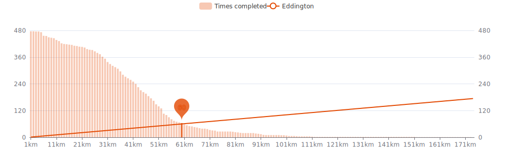

    

Since I began cycling `9 months and 2 weeks` ago on `27-03-2023`,
I had `202 cycling days`. 
I recorded a total distance of `7 720 km`
(`0.19` trips around the world 🌍 and
`0.020` trips to the moon 🌕),
an elevation of `62 193 m`
(`7.0` times Mount Everest 🏔)
and a total time of `1w 4d 13h 59m` 🎉

That's a daily average of `29 km`,
a weekly average of `198 km` and a
monthly average of `858 km` 🐣

I burned `159593 calories` doing so, that's about `591` pizza slices 🍕

---

<kbd><a href="#weekly-distances">Weekly distances</a></kbd> |
<kbd><a href="#activities">Activities</a></kbd> |
<kbd><a href="#monthly-stats">Monthly stats</a></kbd> |
<kbd><a href="#activity-intensity">Activity intensity</a></kbd> |
<kbd><a href="#stats-per-weekday">Stats per weekday</a></kbd> |
<kbd><a href="#daytime-stats">Daytime stats</a></kbd> |
<kbd><a href="#stats-per-bike">Stats per bike</a></kbd> |
<kbd><a href="#best-power-outputs-over-time">Power outputs</a></kbd> |
<kbd><a href="#eddington-chart">Eddington</a></kbd> |
<kbd><a href="#distance-breakdown">Distance breakdown</a></kbd> |
<kbd><a href="#challenge-consistency">Challenge consistency</a></kbd> |
<kbd><a href="#completed-challenges">Completed challenges</a></kbd>

## Weekly distances

## Activities

<table>
    <tr>
        <th></th>
        <th></th>
        <th align="center"></th>
        <th align="center"></th>
        <th align="center"></th>
        <th align="center"></th>
        <th align="center"></th>
        <th align="center"></th>
    </tr>
            <tr>
            <td>22-12-23</td>
            <td>
                
                <a href="https://www.strava.com/activities/10419318583" title="Kcal: 312 | Gear: Zwift Hub ">Recovery in Watopia</a>
            </td>
            <td align="center">24 km</td>
            <td align="center">38 m</td>
            <td align="center">46:34</td>
            <td align="center">117 w</td>
            <td align="center">31.2 km/h</td>
            <td align="center">137</td>
        </tr>
            <tr>
            <td>21-12-23</td>
            <td>
                
                <a href="https://www.strava.com/activities/10414507290" title="Kcal: 3340 | Gear: Zwift Hub ">The PRL Full in London</a>
            </td>
            <td align="center">174 km</td>
            <td align="center">2 622 m</td>
            <td align="center">6:08:32</td>
            <td align="center">158 w</td>
            <td align="center">28.3 km/h</td>
            <td align="center">157</td>
        </tr>
            <tr>
            <td>20-12-23</td>
            <td>
                
                <a href="https://www.strava.com/activities/10411728183" title="Kcal: 419 | Gear: City bike ">⚽️ 🟢⚫️ ⚽️</a>
            </td>
            <td align="center">13 km</td>
            <td align="center">25 m</td>
            <td align="center">43:47</td>
            <td align="center">57 w</td>
            <td align="center">17.7 km/h</td>
            <td align="center">132</td>
        </tr>
            <tr>
            <td>19-12-23</td>
            <td>
                
                <a href="https://www.strava.com/activities/10404386502" title="Kcal: 793 | Gear: Zwift Hub ">Zone 2 in Watopia</a>
            </td>
            <td align="center">55 km</td>
            <td align="center">85 m</td>
            <td align="center">1:33:21</td>
            <td align="center">148 w</td>
            <td align="center">35.2 km/h</td>
            <td align="center">143</td>
        </tr>
            <tr>
            <td>18-12-23</td>
            <td>
                
                <a href="https://www.strava.com/activities/10399341605" title="Kcal: 768 | Gear: Zwift Hub ">Zone 2 in Watopia</a>
            </td>
            <td align="center">51 km</td>
            <td align="center">79 m</td>
            <td align="center">1:31:32</td>
            <td align="center">146 w</td>
            <td align="center">33.7 km/h</td>
            <td align="center">138</td>
        </tr>
        </table>

    
Older activities

    <table>
        <tr>
            <th></th>
            <th></th>
            <th align="center"></th>
            <th align="center"></th>
            <th align="center"></th>
            <th align="center"></th>
            <th align="center"></th>
            <th align="center"></th>
        </tr>
                    <tr>
                <td>15-12-23</td>
                <td>
                    
                    <a href="https://www.strava.com/activities/10383365502" title="Kcal: 1571 | Gear: Zwift Hub ">The Pretzel in Watopia</a>
                </td>
                <td align="center">73 km</td>
                <td align="center">1 364 m</td>
                <td align="center">2:38:06</td>
                <td align="center">173 w</td>
                <td align="center">27.8 km/h</td>
                <td align="center">146</td>
            </tr>
                    <tr>
                <td>14-12-23</td>
                <td>
                    
                    <a href="https://www.strava.com/activities/10378934674" title="Kcal: 1056 | Gear: Zwift Hub ">Shorelines and Summits in ...</a>
                </td>
                <td align="center">50 km</td>
                <td align="center">793 m</td>
                <td align="center">1:39:50</td>
                <td align="center">184 w</td>
                <td align="center">30.2 km/h</td>
                <td align="center">153</td>
            </tr>
                    <tr>
                <td>13-12-23</td>
                <td>
                    
                    <a href="https://www.strava.com/activities/10376290705" title="Kcal: 211 | Gear: City bike ">⚽️ Tita-🧙‍♂️ ⚽️</a>
                </td>
                <td align="center">8 km</td>
                <td align="center">21 m</td>
                <td align="center">25:25</td>
                <td align="center">62 w</td>
                <td align="center">19.6 km/h</td>
                <td align="center">116</td>
            </tr>
                    <tr>
                <td>13-12-23</td>
                <td>
                    
                    <a href="https://www.strava.com/activities/10374722819" title="Kcal: 1048 | Gear: Zwift Hub ">Explosive SST #2 in Watopia</a>
                </td>
                <td align="center">58 km</td>
                <td align="center">290 m</td>
                <td align="center">1:38:26</td>
                <td align="center">186 w</td>
                <td align="center">35.6 km/h</td>
                <td align="center">167</td>
            </tr>
                    <tr>
                <td>12-12-23</td>
                <td>
                    
                    <a href="https://www.strava.com/activities/10372470164" title="Kcal: 118 | Gear: City bike ">Evening Ride 📽️</a>
                </td>
                <td align="center">8 km</td>
                <td align="center">17 m</td>
                <td align="center">23:00</td>
                <td align="center">77 w</td>
                <td align="center">21.5 km/h</td>
                <td align="center">114</td>
            </tr>
                    <tr>
                <td>11-12-23</td>
                <td>
                    
                    <a href="https://www.strava.com/activities/10364124111" title="Kcal: 769 | Gear: Zwift Hub ">Zone 2 in Watopia</a>
                </td>
                <td align="center">52 km</td>
                <td align="center">80 m</td>
                <td align="center">1:31:34</td>
                <td align="center">147 w</td>
                <td align="center">34.3 km/h</td>
                <td align="center">137</td>
            </tr>
                    <tr>
                <td>11-12-23</td>
                <td>
                    
                    <a href="https://www.strava.com/activities/10363267589" title="Kcal: 84 | Gear: City bike ">Lunch Ride 👨🏻‍⚕️</a>
                </td>
                <td align="center">5 km</td>
                <td align="center">22 m</td>
                <td align="center">16:00</td>
                <td align="center">79 w</td>
                <td align="center">20.2 km/h</td>
                <td align="center">113</td>
            </tr>
                    <tr>
                <td>10-12-23</td>
                <td>
                    
                    <a href="https://www.strava.com/activities/10358363860" title="Kcal: 914 | Gear: Zwift Hub ">Aerobic Builds in Watopia</a>
                </td>
                <td align="center">53 km</td>
                <td align="center">234 m</td>
                <td align="center">1:30:34</td>
                <td align="center">176 w</td>
                <td align="center">34.8 km/h</td>
                <td align="center">161</td>
            </tr>
                    <tr>
                <td>09-12-23</td>
                <td>
                    
                    <a href="https://www.strava.com/activities/10354269405" title="Kcal: 175 | Gear: City bike ">⚽️ 🟢⚫️ ⚽️</a>
                </td>
                <td align="center">13 km</td>
                <td align="center">22 m</td>
                <td align="center">43:26</td>
                <td align="center">61 w</td>
                <td align="center">18.1 km/h</td>
                <td align="center">129</td>
            </tr>
                    <tr>
                <td>08-12-23</td>
                <td>
                    
                    <a href="https://www.strava.com/activities/10349972882" title="Kcal: 121 | Gear: City bike ">⚽️ Tita-🧙‍♂️ ⚽️</a>
                </td>
                <td align="center">9 km</td>
                <td align="center">22 m</td>
                <td align="center">25:39</td>
                <td align="center">71 w</td>
                <td align="center">19.9 km/h</td>
                <td align="center">118</td>
            </tr>
                    <tr>
                <td>08-12-23</td>
                <td>
                    
                    <a href="https://www.strava.com/activities/10348726353" title="Kcal: 408 | Gear: Zwift Hub ">Workout in Watopia</a>
                </td>
                <td align="center">24 km</td>
                <td align="center">93 m</td>
                <td align="center">45:14</td>
                <td align="center">158 w</td>
                <td align="center">32.4 km/h</td>
                <td align="center">145</td>
            </tr>
                    <tr>
                <td>08-12-23</td>
                <td>
                    
                    <a href="https://www.strava.com/activities/10348522816" title="Kcal: 649 | Gear: Zwift Hub ">Purple Unicorn in Watopia</a>
                </td>
                <td align="center">37 km</td>
                <td align="center">57 m</td>
                <td align="center">1:00:13</td>
                <td align="center">188 w</td>
                <td align="center">36.7 km/h</td>
                <td align="center">156</td>
            </tr>
                    <tr>
                <td>07-12-23</td>
                <td>
                    
                    <a href="https://www.strava.com/activities/10343720768" title="Kcal: 632 | Gear: Zwift Hub ">Zone 2 in Watopia</a>
                </td>
                <td align="center">42 km</td>
                <td align="center">65 m</td>
                <td align="center">1:15:27</td>
                <td align="center">146 w</td>
                <td align="center">33.8 km/h</td>
                <td align="center">129</td>
            </tr>
                    <tr>
                <td>06-12-23</td>
                <td>
                    
                    <a href="https://www.strava.com/activities/10338437564" title="Kcal: 633 | Gear: Zwift Hub ">8/6/4min Threshold in Watopia</a>
                </td>
                <td align="center">37 km</td>
                <td align="center">57 m</td>
                <td align="center">1:00:20</td>
                <td align="center">183 w</td>
                <td align="center">36.7 km/h</td>
                <td align="center">155</td>
            </tr>
                    <tr>
                <td>05-12-23</td>
                <td>
                    
                    <a href="https://www.strava.com/activities/10333025651" title="Kcal: 767 | Gear: Zwift Hub ">Zone 2 in Watopia</a>
                </td>
                <td align="center">52 km</td>
                <td align="center">81 m</td>
                <td align="center">1:30:53</td>
                <td align="center">147 w</td>
                <td align="center">34.6 km/h</td>
                <td align="center">132</td>
            </tr>
                    <tr>
                <td>02-12-23</td>
                <td>
                    
                    <a href="https://www.strava.com/activities/10320638309" title="Kcal: 315 | Gear: City bike ">Dinner 🍽️ 🍕</a>
                </td>
                <td align="center">12 km</td>
                <td align="center">31 m</td>
                <td align="center">42:13</td>
                <td align="center">52 w</td>
                <td align="center">17.6 km/h</td>
                <td align="center">114</td>
            </tr>
                    <tr>
                <td>02-12-23</td>
                <td>
                    
                    <a href="https://www.strava.com/activities/10316770449" title="Kcal: 761 | Gear: Zwift Hub ">Zone 2 in Watopia</a>
                </td>
                <td align="center">52 km</td>
                <td align="center">79 m</td>
                <td align="center">1:30:24</td>
                <td align="center">147 w</td>
                <td align="center">34.2 km/h</td>
                <td align="center">135</td>
            </tr>
                    <tr>
                <td>02-12-23</td>
                <td>
                    
                    <a href="https://www.strava.com/activities/10315481314" title="Kcal: 161 | Gear: City bike ">Lunch Ride ❄️</a>
                </td>
                <td align="center">7 km</td>
                <td align="center">4 m</td>
                <td align="center">23:19</td>
                <td align="center">53 w</td>
                <td align="center">17.6 km/h</td>
                <td align="center">106</td>
            </tr>
                    <tr>
                <td>01-12-23</td>
                <td>
                    
                    <a href="https://www.strava.com/activities/10311834483" title="Kcal: 185 | Gear: Zwift Hub ">Cooldown in Watopia</a>
                </td>
                <td align="center">13 km</td>
                <td align="center">52 m</td>
                <td align="center">25:11</td>
                <td align="center">129 w</td>
                <td align="center">31.4 km/h</td>
                <td align="center">148</td>
            </tr>
                    <tr>
                <td>01-12-23</td>
                <td>
                    
                    <a href="https://www.strava.com/activities/10311723468" title="Kcal: 679 | Gear: Zwift Hub ">Race: Race #2 | Cobbled Cl...</a>
                </td>
                <td align="center">28 km</td>
                <td align="center">404 m</td>
                <td align="center">46:25</td>
                <td align="center">234 w</td>
                <td align="center">36.3 km/h</td>
                <td align="center">183</td>
            </tr>
                    <tr>
                <td>01-12-23</td>
                <td>
                    
                    <a href="https://www.strava.com/activities/10311499785" title="Kcal: 147 | Gear: Zwift Hub ">WarmUp on Cobbled Climbs i...</a>
                </td>
                <td align="center">9 km</td>
                <td align="center">45 m</td>
                <td align="center">17:05</td>
                <td align="center">151 w</td>
                <td align="center">32.1 km/h</td>
                <td align="center">153</td>
            </tr>
                    <tr>
                <td>30-11-23</td>
                <td>
                    
                    <a href="https://www.strava.com/activities/10306962649" title="Kcal: 761 | Gear: Zwift Hub ">Zone 2 in Watopia</a>
                </td>
                <td align="center">52 km</td>
                <td align="center">79 m</td>
                <td align="center">1:30:26</td>
                <td align="center">147 w</td>
                <td align="center">34.4 km/h</td>
                <td align="center">132</td>
            </tr>
                    <tr>
                <td>29-11-23</td>
                <td>
                    
                    <a href="https://www.strava.com/activities/10302017000" title="Kcal: 917 | Gear: Zwift Hub ">Zwift Academy: Workout 6 |...</a>
                </td>
                <td align="center">51 km</td>
                <td align="center">231 m</td>
                <td align="center">1:22:28</td>
                <td align="center">194 w</td>
                <td align="center">36.9 km/h</td>
                <td align="center">166</td>
            </tr>
                    <tr>
                <td>27-11-23</td>
                <td>
                    
                    <a href="https://www.strava.com/activities/10290828189" title="Kcal: 644 | Gear: Zwift Hub ">Zone 2 in Watopia</a>
                </td>
                <td align="center">42 km</td>
                <td align="center">177 m</td>
                <td align="center">1:16:39</td>
                <td align="center">147 w</td>
                <td align="center">32.9 km/h</td>
                <td align="center">130</td>
            </tr>
                    <tr>
                <td>27-11-23</td>
                <td>
                    
                    <a href="https://www.strava.com/activities/10291305683" title="Kcal: 466 | Gear: City bike ">Lunch Ride 🚂</a>
                </td>
                <td align="center">5 km</td>
                <td align="center">19 m</td>
                <td align="center">16:03</td>
                <td align="center">72 w</td>
                <td align="center">19.1 km/h</td>
                <td align="center">115</td>
            </tr>
                    <tr>
                <td>26-11-23</td>
                <td>
                    
                    <a href="https://www.strava.com/activities/10285029697" title="Kcal: 775 | Gear: Zwift Hub ">Zone 2 in Watopia</a>
                </td>
                <td align="center">50 km</td>
                <td align="center">228 m</td>
                <td align="center">1:31:33</td>
                <td align="center">148 w</td>
                <td align="center">32.8 km/h</td>
                <td align="center">135</td>
            </tr>
                    <tr>
                <td>25-11-23</td>
                <td>
                    
                    <a href="https://www.strava.com/activities/10280423956" title="Kcal: 333 | Gear: City bike ">2 - 0 🟢⚫️</a>
                </td>
                <td align="center">13 km</td>
                <td align="center">27 m</td>
                <td align="center">37:55</td>
                <td align="center">71 w</td>
                <td align="center">20 km/h</td>
                <td align="center">123</td>
            </tr>
                    <tr>
                <td>24-11-23</td>
                <td>
                    
                    <a href="https://www.strava.com/activities/10273613941" title="Kcal: 153 | Gear: Zwift Hub ">Cooldown in Watopia</a>
                </td>
                <td align="center">10 km</td>
                <td align="center">46 m</td>
                <td align="center">20:51</td>
                <td align="center">128 w</td>
                <td align="center">29.3 km/h</td>
                <td align="center">146</td>
            </tr>
                    <tr>
                <td>24-11-23</td>
                <td>
                    
                    <a href="https://www.strava.com/activities/10273526366" title="Kcal: 552 | Gear: Zwift Hub ">Race: Race #1 | Rolling Hi...</a>
                </td>
                <td align="center">23 km</td>
                <td align="center">183 m</td>
                <td align="center">33:04</td>
                <td align="center">242 w</td>
                <td align="center">42.5 km/h</td>
                <td align="center">183</td>
            </tr>
                    <tr>
                <td>24-11-23</td>
                <td>
                    
                    <a href="https://www.strava.com/activities/10273344624" title="Kcal: 156 | Gear: Zwift Hub ">WarmUp in Watopia</a>
                </td>
                <td align="center">10 km</td>
                <td align="center">49 m</td>
                <td align="center">19:44</td>
                <td align="center">138 w</td>
                <td align="center">31.3 km/h</td>
                <td align="center">143</td>
            </tr>
                    <tr>
                <td>23-11-23</td>
                <td>
                    
                    <a href="https://www.strava.com/activities/10269273945" title="Kcal: 613 | Gear: Zwift Hub ">Zone 2 in Watopia</a>
                </td>
                <td align="center">39 km</td>
                <td align="center">163 m</td>
                <td align="center">1:10:50</td>
                <td align="center">151 w</td>
                <td align="center">33.4 km/h</td>
                <td align="center">146</td>
            </tr>
                    <tr>
                <td>22-11-23</td>
                <td>
                    
                    <a href="https://www.strava.com/activities/10277166490" title="Kcal: 205 | Gear: City bike ">Evening Ride</a>
                </td>
                <td align="center">7 km</td>
                <td align="center">6 m</td>
                <td align="center">23:16</td>
                <td align="center">55 w</td>
                <td align="center">17.5 km/h</td>
                <td align="center">115</td>
            </tr>
                    <tr>
                <td>22-11-23</td>
                <td>
                    
                    <a href="https://www.strava.com/activities/10263280711" title="Kcal: 564 | Gear: Zwift Hub ">Zwift Academy: Workout 5 |...</a>
                </td>
                <td align="center">30 km</td>
                <td align="center">138 m</td>
                <td align="center">50:02</td>
                <td align="center">197 w</td>
                <td align="center">36.1 km/h</td>
                <td align="center">173</td>
            </tr>
                    <tr>
                <td>19-11-23</td>
                <td>
                    
                    <a href="https://www.strava.com/activities/10245804263" title="Kcal: 526 | Gear: Zwift Hub ">Zone 2 in Watopia</a>
                </td>
                <td align="center">32 km</td>
                <td align="center">132 m</td>
                <td align="center">1:00:14</td>
                <td align="center">152 w</td>
                <td align="center">32.1 km/h</td>
                <td align="center">148</td>
            </tr>
                    <tr>
                <td>18-11-23</td>
                <td>
                    
                    <a href="https://www.strava.com/activities/10239085396" title="Kcal: 406 | Gear: Zwift Hub ">Zwift Academy: Workout 4 |...</a>
                </td>
                <td align="center">17 km</td>
                <td align="center">342 m</td>
                <td align="center">37:25</td>
                <td align="center">190 w</td>
                <td align="center">27.2 km/h</td>
                <td align="center">166</td>
            </tr>
                    <tr>
                <td>17-11-23</td>
                <td>
                    
                    <a href="https://www.strava.com/activities/10234592496" title="Kcal: 459 | Gear: City bike ">Afternoon Ride</a>
                </td>
                <td align="center">12 km</td>
                <td align="center">30 m</td>
                <td align="center">42:56</td>
                <td align="center">57 w</td>
                <td align="center">17.3 km/h</td>
                <td align="center">124</td>
            </tr>
                    <tr>
                <td>15-11-23</td>
                <td>
                    
                    <a href="https://www.strava.com/activities/10224305733" title="Kcal: 538 | Gear: Zwift Hub ">Zone 2 in Scotland</a>
                </td>
                <td align="center">32 km</td>
                <td align="center">253 m</td>
                <td align="center">1:00:07</td>
                <td align="center">156 w</td>
                <td align="center">31.7 km/h</td>
                <td align="center">149</td>
            </tr>
                    <tr>
                <td>14-11-23</td>
                <td>
                    
                    <a href="https://www.strava.com/activities/10217807507" title="Kcal: 1036 | Gear: Zwift Hub ">Zwift Academy: Workout 3 |...</a>
                </td>
                <td align="center">49 km</td>
                <td align="center">463 m</td>
                <td align="center">1:31:39</td>
                <td align="center">197 w</td>
                <td align="center">32.1 km/h</td>
                <td align="center">167</td>
            </tr>
                    <tr>
                <td>11-11-23</td>
                <td>
                    
                    <a href="https://www.strava.com/activities/10200546300" title="Kcal: 743 | Gear: Zwift Hub ">Zone 2 in Watopia</a>
                </td>
                <td align="center">48 km</td>
                <td align="center">198 m</td>
                <td align="center">1:25:35</td>
                <td align="center">152 w</td>
                <td align="center">34 km/h</td>
                <td align="center">137</td>
            </tr>
                    <tr>
                <td>09-11-23</td>
                <td>
                    
                    <a href="https://www.strava.com/activities/10192762891" title="Kcal: 277 | Gear: City bike ">Evening Ride 🍽️</a>
                </td>
                <td align="center">7 km</td>
                <td align="center">7 m</td>
                <td align="center">25:23</td>
                <td align="center">56 w</td>
                <td align="center">16.8 km/h</td>
                <td align="center">122</td>
            </tr>
                    <tr>
                <td>09-11-23</td>
                <td>
                    
                    <a href="https://www.strava.com/activities/10189156919" title="Kcal: 500 | Gear: Zwift Hub ">Zwift Academy: Workout 2 |...</a>
                </td>
                <td align="center">27 km</td>
                <td align="center">125 m</td>
                <td align="center">45:36</td>
                <td align="center">191 w</td>
                <td align="center">34.9 km/h</td>
                <td align="center">158</td>
            </tr>
                    <tr>
                <td>09-11-23</td>
                <td>
                    
                    <a href="https://www.strava.com/activities/10187948113" title="Kcal: 306 | Gear: City bike ">🩺 👨🏻‍⚕️</a>
                </td>
                <td align="center">12 km</td>
                <td align="center">30 m</td>
                <td align="center">35:14</td>
                <td align="center">71 w</td>
                <td align="center">20.4 km/h</td>
                <td align="center">125</td>
            </tr>
                    <tr>
                <td>08-11-23</td>
                <td>
                    
                    <a href="https://www.strava.com/activities/10183550766" title="Kcal: 830 | Gear: Zwift Hub ">Zwift Academy: Workout 1 |...</a>
                </td>
                <td align="center">46 km</td>
                <td align="center">208 m</td>
                <td align="center">1:21:19</td>
                <td align="center">178 w</td>
                <td align="center">34.2 km/h</td>
                <td align="center">166</td>
            </tr>
                    <tr>
                <td>07-11-23</td>
                <td>
                    
                    <a href="https://www.strava.com/activities/10178892877" title="Kcal: 371 | Gear: City bike ">⚽️ Tita-🧙‍♂️ ⚽️</a>
                </td>
                <td align="center">12 km</td>
                <td align="center">25 m</td>
                <td align="center">39:18</td>
                <td align="center">65 w</td>
                <td align="center">18.8 km/h</td>
                <td align="center">133</td>
            </tr>
                    <tr>
                <td>06-11-23</td>
                <td>
                    
                    <a href="https://www.strava.com/activities/10171112185" title="Kcal: 608 | Gear: Zwift Hub ">Sneaky on Sleepless City i...</a>
                </td>
                <td align="center">33 km</td>
                <td align="center">278 m</td>
                <td align="center">1:00:29</td>
                <td align="center">175 w</td>
                <td align="center">32.6 km/h</td>
                <td align="center">153</td>
            </tr>
                    <tr>
                <td>05-11-23</td>
                <td>
                    
                    <a href="https://www.strava.com/activities/10163140681" title="Kcal: 531 | Gear: Zwift Hub ">Zone 2 in Watopia</a>
                </td>
                <td align="center">31 km</td>
                <td align="center">165 m</td>
                <td align="center">1:00:48</td>
                <td align="center">152 w</td>
                <td align="center">30.7 km/h</td>
                <td align="center">149</td>
            </tr>
                    <tr>
                <td>04-11-23</td>
                <td>
                    
                    <a href="https://www.strava.com/activities/10159634381" title="Kcal: 321 | Gear: City bike ">🪚🪓</a>
                </td>
                <td align="center">11 km</td>
                <td align="center">15 m</td>
                <td align="center">33:56</td>
                <td align="center">67 w</td>
                <td align="center">19.8 km/h</td>
                <td align="center">130</td>
            </tr>
                    <tr>
                <td>03-11-23</td>
                <td>
                    
                    <a href="https://www.strava.com/activities/10153806110" title="Kcal: 903 | Gear: Zwift Hub ">Zone 2 in Watopia</a>
                </td>
                <td align="center">52 km</td>
                <td align="center">274 m</td>
                <td align="center">1:41:21</td>
                <td align="center">155 w</td>
                <td align="center">30.9 km/h</td>
                <td align="center">n/a</td>
            </tr>
                    <tr>
                <td>02-11-23</td>
                <td>
                    
                    <a href="https://www.strava.com/activities/10149838071" title="Kcal: 613 | Gear: None ">Cyclo boys</a>
                </td>
                <td align="center">24 km</td>
                <td align="center">0 m</td>
                <td align="center">41:36</td>
                <td align="center">221 w</td>
                <td align="center">35.1 km/h</td>
                <td align="center">n/a</td>
            </tr>
                    <tr>
                <td>02-11-23</td>
                <td>
                    
                    <a href="https://www.strava.com/activities/10149472103" title="Kcal: 166 | Gear: City bike ">Afternoon Ride</a>
                </td>
                <td align="center">6 km</td>
                <td align="center">14 m</td>
                <td align="center">18:03</td>
                <td align="center">70 w</td>
                <td align="center">19.6 km/h</td>
                <td align="center">127</td>
            </tr>
            </table>

## Monthly stats

<table>
    <thead>
    <tr>
        <th>&nbsp;&nbsp;&nbsp;&nbsp;&nbsp;</th>
        <th># of rides</th>
        <th align="center"></th>
        <th align="center"></th>
        <th align="center"></th>
        <th align="center"></th>
    </tr>
    </thead>
    <tbody>
            <tr>
            <td align="center">December 2023</td>
            <td align="center">26</td>
            <td align="center">962 km</td>
            <td align="center">6 680 m</td>
            <td align="center">1d 7h 32m</td>
            <td align="center">8</td>
        </tr>
            <tr>
            <td align="center">November 2023</td>
            <td align="center">30</td>
            <td align="center">828 km</td>
            <td align="center">4 113 m</td>
            <td align="center">1d 2h 45m</td>
            <td align="center">11</td>
        </tr>
            <tr>
            <td align="center">October 2023</td>
            <td align="center">35</td>
            <td align="center">930 km</td>
            <td align="center">8 462 m</td>
            <td align="center">1d 7h 32m</td>
            <td align="center">18</td>
        </tr>
            <tr>
            <td align="center">September 2023</td>
            <td align="center">30</td>
            <td align="center">1 016 km</td>
            <td align="center">6 410 m</td>
            <td align="center">1d 10h 29m</td>
            <td align="center">20</td>
        </tr>
            <tr>
            <td align="center">August 2023</td>
            <td align="center">26</td>
            <td align="center">885 km</td>
            <td align="center">9 813 m</td>
            <td align="center">1d 10h 9m</td>
            <td align="center">19</td>
        </tr>
            <tr>
            <td align="center">July 2023</td>
            <td align="center">31</td>
            <td align="center">1 016 km</td>
            <td align="center">6 634 m</td>
            <td align="center">1d 12h 42m</td>
            <td align="center">20</td>
        </tr>
            <tr>
            <td align="center">June 2023</td>
            <td align="center">28</td>
            <td align="center">839 km</td>
            <td align="center">9 384 m</td>
            <td align="center">1d 10h 13m</td>
            <td align="center">22</td>
        </tr>
            <tr>
            <td align="center">May 2023</td>
            <td align="center">32</td>
            <td align="center">722 km</td>
            <td align="center">7 242 m</td>
            <td align="center">1d 4h 1m</td>
            <td align="center">10</td>
        </tr>
            <tr>
            <td align="center">April 2023</td>
            <td align="center">23</td>
            <td align="center">509 km</td>
            <td align="center">3 429 m</td>
            <td align="center">19h 33m</td>
            <td align="center">7</td>
        </tr>
            <tr>
            <td align="center">March 2023</td>
            <td align="center">2</td>
            <td align="center">12 km</td>
            <td align="center">27 m</td>
            <td align="center">59m</td>
            <td align="center">0</td>
        </tr>
        <tr>
        <td align="center"><b>Virtual/Indoor</b></td>
        <td align="center"><b>171</td>
        <td align="center"><b>5 808 km</b></td>
        <td align="center"><b>55 192 m</b></td>
        <td align="center"><b>1w 1d 1h 46m</b></td>
        <td align="center"></td>
    </tr>
    <tr>
        <td align="center"><b>Outside</b></td>
        <td align="center"><b>92</td>
        <td align="center"><b>1 911 km</b></td>
        <td align="center"><b>7 001 m</b></td>
        <td align="center"><b>3d 12h 13m</b></td>
        <td align="center"></td>
    </tr>
    <tr>
        <td align="center"><b>Total</b></td>
        <td align="center"><b>263</td>
        <td align="center"><b>7 720 km</b></td>
        <td align="center"><b>62 193 m</b></td>
        <td align="center"><b>1w 4d 13h 59m</b></td>
        <td align="center"></td>
    </tr>
    </tbody>
</table>

## Activity intensity

## Stats per weekday

<table>
    <thead>
    <tr>
        <th></th>
        <th># of rides</th>
        <th align="center"></th>
        <th align="center"></th>
        <th align="center"></th>
        <th align="center"></th>
    </tr>
    </thead>
    <tbody>
            <tr>
            <td align="center">Monday</td>
            <td align="center">32</td>
            <td align="center">
                                    30 km avg /
                    945 km total
                            </td>
            <td align="center">8 051 m</td>
            <td align="center">1d 8h 44m</td>
            <td align="center">28.9 km/h</td>
        </tr>
            <tr>
            <td align="center">Tuesday</td>
            <td align="center">34</td>
            <td align="center">
                                    34 km avg /
                    1 158 km total
                            </td>
            <td align="center">10 130 m</td>
            <td align="center">1d 17h 16m</td>
            <td align="center">28.0 km/h</td>
        </tr>
            <tr>
            <td align="center">Wednesday</td>
            <td align="center">48</td>
            <td align="center">
                                    30 km avg /
                    1 425 km total
                            </td>
            <td align="center">10 437 m</td>
            <td align="center">2d 3h 17m</td>
            <td align="center">27.8 km/h</td>
        </tr>
            <tr>
            <td align="center">Thursday</td>
            <td align="center">36</td>
            <td align="center">
                                    30 km avg /
                    1 066 km total
                            </td>
            <td align="center">11 417 m</td>
            <td align="center">1d 14h 56m</td>
            <td align="center">27.4 km/h</td>
        </tr>
            <tr>
            <td align="center">Friday</td>
            <td align="center">44</td>
            <td align="center">
                                    27 km avg /
                    1 168 km total
                            </td>
            <td align="center">8 755 m</td>
            <td align="center">1d 17h 34m</td>
            <td align="center">28.1 km/h</td>
        </tr>
            <tr>
            <td align="center">Saturday</td>
            <td align="center">39</td>
            <td align="center">
                                    25 km avg /
                    968 km total
                            </td>
            <td align="center">6 669 m</td>
            <td align="center">1d 12h 25m</td>
            <td align="center">26.6 km/h</td>
        </tr>
            <tr>
            <td align="center">Sunday</td>
            <td align="center">30</td>
            <td align="center">
                                    33 km avg /
                    989 km total
                            </td>
            <td align="center">6 735 m</td>
            <td align="center">1d 11h 45m</td>
            <td align="center">27.6 km/h</td>
        </tr>
        </tbody>
</table>

## Daytime stats

<table>
    <thead>
    <tr>
        <th></th>
        <th># of rides</th>
        <th align="center"></th>
        <th align="center"></th>
        <th align="center"></th>
        <th align="center"></th>
    </tr>
    </thead>
    <tbody>
            <tr>
            <td align="center">Morning (6h - 12h)</td>
            <td align="center">49</td>
            <td align="center">
                                    32 km avg /
                    1 545 km total
                            </td>
            <td align="center">12 041 m</td>
            <td align="center">2d 13h 52m</td>
            <td align="center">25.0 km/h</td>
        </tr>
            <tr>
            <td align="center">Afternoon (12h - 17h)</td>
            <td align="center">133</td>
            <td align="center">
                                    32 km avg /
                    4 242 km total
                            </td>
            <td align="center">35 971 m</td>
            <td align="center">6d 3h 46m</td>
            <td align="center">28.7 km/h</td>
        </tr>
            <tr>
            <td align="center">Evening (17h - 23h)</td>
            <td align="center">79</td>
            <td align="center">
                                    24 km avg /
                    1 926 km total
                            </td>
            <td align="center">14 173 m</td>
            <td align="center">2d 19h 59m</td>
            <td align="center">28.3 km/h</td>
        </tr>
            <tr>
            <td align="center">Night (23h - 6h)</td>
            <td align="center">2</td>
            <td align="center">
                                    4 km avg /
                    7 km total
                            </td>
            <td align="center">9 m</td>
            <td align="center">20m</td>
            <td align="center">20.5 km/h</td>
        </tr>
        </tbody>
</table>

## Stats per bike

<table>
    <thead>
    <tr>
        <th></th>
        <th># of rides</th>
        <th align="center"></th>
        <th align="center"></th>
        <th align="center"></th>
        <th align="center"></th>
    </tr>
    </thead>
    <tbody>
            <tr>
            <td align="center">Zwift Hub</td>
            <td align="center">138</td>
            <td align="center">
                                    35 km avg /
                    4 842 km total
                            </td>
            <td align="center">46 483 m</td>
            <td align="center">6d 14h 56m</td>
            <td align="center">30.5 km/h</td>
        </tr>
            <tr>
            <td align="center">Retro Race Bike</td>
            <td align="center">41</td>
            <td align="center">
                                    35 km avg /
                    1 450 km total
                            </td>
            <td align="center">6 290 m</td>
            <td align="center">2d 10h 58m</td>
            <td align="center">24.6 km/h</td>
        </tr>
            <tr>
            <td align="center">Elite Direto XR-T ☠️</td>
            <td align="center">33</td>
            <td align="center">
                                    29 km avg /
                    966 km total
                            </td>
            <td align="center">8 709 m</td>
            <td align="center">1d 10h 49m</td>
            <td align="center">27.7 km/h</td>
        </tr>
            <tr>
            <td align="center">City bike</td>
            <td align="center">50</td>
            <td align="center">
                                    9 km avg /
                    438 km total
                            </td>
            <td align="center">712 m</td>
            <td align="center">1d 32m</td>
            <td align="center">17.8 km/h</td>
        </tr>
            <tr>
            <td align="center">Other</td>
            <td align="center">1</td>
            <td align="center">
                                    24 km avg /
                    24 km total
                            </td>
            <td align="center">0 m</td>
            <td align="center">41m</td>
            <td align="center">35.1 km/h</td>
        </tr>
        </tbody>
</table>

## Best power outputs over time

<table>
    <tr>
        <th align="center"></th>
        <th align="center" colspan="2"></th>
        <th></th>
    </tr>
                    <tr>
            <td align="center">5 s</td>
            <td align="center">680 w</td>
            <td align="center">10 w/kg</td>
            <td>
                
                <a href="https://www.strava.com/activities/10183550766">
                    Zwift Academy: Workout 1 | Explosive 30s in Makuri Islands
                </a>
            </td>
        </tr>
                    <tr>
            <td align="center">10 s</td>
            <td align="center">584 w</td>
            <td align="center">8.59 w/kg</td>
            <td>
                
                <a href="https://www.strava.com/activities/10183550766">
                    Zwift Academy: Workout 1 | Explosive 30s in Makuri Islands
                </a>
            </td>
        </tr>
                    <tr>
            <td align="center">30 s</td>
            <td align="center">442 w</td>
            <td align="center">6.41 w/kg</td>
            <td>
                
                <a href="https://www.strava.com/activities/9763146204">
                    Race: 3R Volcano Flat Race - 3 Laps (36.6km/22.7mi 138m) (B) on Vol...
                </a>
            </td>
        </tr>
                    <tr>
            <td align="center">1 m</td>
            <td align="center">354 w</td>
            <td align="center">5.13 w/kg</td>
            <td>
                
                <a href="https://www.strava.com/activities/9796786381">
                    Wild Starts in London
                </a>
            </td>
        </tr>
                    <tr>
            <td align="center">5 m</td>
            <td align="center">281 w</td>
            <td align="center">4.07 w/kg</td>
            <td>
                
                <a href="https://www.strava.com/activities/9751176666">
                    Race: STAGE 9 TOUR DE HISP (B) on Greatest London Flat in London
                </a>
            </td>
        </tr>
                    <tr>
            <td align="center">8 m</td>
            <td align="center">273 w</td>
            <td align="center">4.01 w/kg</td>
            <td>
                
                <a href="https://www.strava.com/activities/10108424983">
                    Race: Stage 4: Race Watopia - Volcano Circuit CCW (B) on Volcano Ci...
                </a>
            </td>
        </tr>
                    <tr>
            <td align="center">20 m</td>
            <td align="center">263 w</td>
            <td align="center">3.87 w/kg</td>
            <td>
                
                <a href="https://www.strava.com/activities/9912127079">
                    Race: Stage 3: Get Rolling - London Classique (B) on Classique in L...
                </a>
            </td>
        </tr>
                    <tr>
            <td align="center">1 h</td>
            <td align="center">218 w</td>
            <td align="center">3.16 w/kg</td>
            <td>
                
                <a href="https://www.strava.com/activities/9724694247">
                    Race: 3R Innsbruckring Flat Race - 5 Laps (44km/27.3mi 385m) (B) on...
                </a>
            </td>
        </tr>
    </table>

## Eddington chart

> The Eddington number in the context of cycling is defined as the maximum number E such that the cyclist has cycled at least E km on at least E days.
>
> For example, an Eddington number of 70 would imply that the cyclist has cycled at least 70 km in a day on at least 70 occasions.
> Achieving a high Eddington number is difficult, since moving from, say, 70 to 75 will (probably) require more than five new long-distance rides, since any rides shorter than 75 km will no longer be included in the reckoning.

<table align="center">
    <tr>
        <th align="center">Eddington</th>
            <th align="center">50 km</th>
            <th align="center">51 km</th>
            <th align="center">52 km</th>
            <th align="center">53 km</th>
            <th align="center">54 km</th>
            <th align="center">55 km</th>
            <th align="center">56 km</th>
            <th align="center">57 km</th>
            <th align="center">58 km</th>
            <th align="center">59 km</th>
            <th align="center">60 km</th>
        </tr>
    <tr>
        <td align="center">Days needed</td>
            <td align="center">4</td>
            <td align="center">9</td>
            <td align="center">14</td>
            <td align="center">25</td>
            <td align="center">27</td>
            <td align="center">31</td>
            <td align="center">35</td>
            <td align="center">37</td>
            <td align="center">39</td>
            <td align="center">40</td>
            <td align="center">42</td>
        </tr>
</table>

## Distance breakdown

<table>
    <thead>
    <tr>
        <th></th>
        <th># of rides</th>
        <th align="center"></th>
        <th align="center"></th>
        <th align="center"></th>
        <th align="center"></th>
    </tr>
    </thead>
    <tbody>
            <tr>
            <td align="center">0 - 10 km</td>
            <td align="center">43</td>
            <td align="center">
                                     6 km avg /
                     278 km total
                            </td>
            <td align="center">1 264 m</td>
            <td align="center">14h 6m</td>
            <td align="center">19.7 km/h</td>
        </tr>
            <tr>
            <td align="center">10 - 20 km</td>
            <td align="center">46</td>
            <td align="center">
                                     13 km avg /
                     602 km total
                            </td>
            <td align="center">1 864 m</td>
            <td align="center">1d 4h 24m</td>
            <td align="center">21.2 km/h</td>
        </tr>
            <tr>
            <td align="center">20 - 30 km</td>
            <td align="center">54</td>
            <td align="center">
                                     25 km avg /
                     1 376 km total
                            </td>
            <td align="center">14 954 m</td>
            <td align="center">2d 8m</td>
            <td align="center">28.6 km/h</td>
        </tr>
            <tr>
            <td align="center">30 - 40 km</td>
            <td align="center">54</td>
            <td align="center">
                                     34 km avg /
                     1 820 km total
                            </td>
            <td align="center">18 294 m</td>
            <td align="center">2d 16h 36m</td>
            <td align="center">28.2 km/h</td>
        </tr>
            <tr>
            <td align="center">40 - 50 km</td>
            <td align="center">28</td>
            <td align="center">
                                     45 km avg /
                     1 258 km total
                            </td>
            <td align="center">10 972 m</td>
            <td align="center">1d 18h 10m</td>
            <td align="center">29.8 km/h</td>
        </tr>
            <tr>
            <td align="center">50 - 60 km</td>
            <td align="center">25</td>
            <td align="center">
                                     53 km avg /
                     1 324 km total
                            </td>
            <td align="center">8 440 m</td>
            <td align="center">1d 19h 55m</td>
            <td align="center">30.1 km/h</td>
        </tr>
            <tr>
            <td align="center">60 - 70 km</td>
            <td align="center">7</td>
            <td align="center">
                                     64 km avg /
                     450 km total
                            </td>
            <td align="center">2 038 m</td>
            <td align="center">15h 3m</td>
            <td align="center">29.9 km/h</td>
        </tr>
            <tr>
            <td align="center">70 - 80 km</td>
            <td align="center">2</td>
            <td align="center">
                                     73 km avg /
                     146 km total
                            </td>
            <td align="center">1 414 m</td>
            <td align="center">5h 8m</td>
            <td align="center">28.4 km/h</td>
        </tr>
            <tr>
            <td align="center">80 - 90 km</td>
            <td align="center">1</td>
            <td align="center">
                                     88 km avg /
                     88 km total
                            </td>
            <td align="center">102 m</td>
            <td align="center">3h 12m</td>
            <td align="center">27.4 km/h</td>
        </tr>
            <tr>
            <td align="center">90 - 100 km</td>
            <td align="center">0</td>
            <td align="center">
                                    0 km
                            </td>
            <td align="center">0 m</td>
            <td align="center"></td>
            <td align="center">0.0 km/h</td>
        </tr>
            <tr>
            <td align="center">100 - 110 km</td>
            <td align="center">2</td>
            <td align="center">
                                     102 km avg /
                     203 km total
                            </td>
            <td align="center">230 m</td>
            <td align="center">7h 3m</td>
            <td align="center">28.8 km/h</td>
        </tr>
            <tr>
            <td align="center">110 - 120 km</td>
            <td align="center">0</td>
            <td align="center">
                                    0 km
                            </td>
            <td align="center">0 m</td>
            <td align="center"></td>
            <td align="center">0.0 km/h</td>
        </tr>
            <tr>
            <td align="center">120 - 130 km</td>
            <td align="center">0</td>
            <td align="center">
                                    0 km
                            </td>
            <td align="center">0 m</td>
            <td align="center"></td>
            <td align="center">0.0 km/h</td>
        </tr>
            <tr>
            <td align="center">130 - 140 km</td>
            <td align="center">0</td>
            <td align="center">
                                    0 km
                            </td>
            <td align="center">0 m</td>
            <td align="center"></td>
            <td align="center">0.0 km/h</td>
        </tr>
            <tr>
            <td align="center">140 - 150 km</td>
            <td align="center">0</td>
            <td align="center">
                                    0 km
                            </td>
            <td align="center">0 m</td>
            <td align="center"></td>
            <td align="center">0.0 km/h</td>
        </tr>
            <tr>
            <td align="center">150 - 160 km</td>
            <td align="center">0</td>
            <td align="center">
                                    0 km
                            </td>
            <td align="center">0 m</td>
            <td align="center"></td>
            <td align="center">0.0 km/h</td>
        </tr>
            <tr>
            <td align="center">160 - 170 km</td>
            <td align="center">0</td>
            <td align="center">
                                    0 km
                            </td>
            <td align="center">0 m</td>
            <td align="center"></td>
            <td align="center">0.0 km/h</td>
        </tr>
            <tr>
            <td align="center">170 - 180 km</td>
            <td align="center">1</td>
            <td align="center">
                                     174 km avg /
                     174 km total
                            </td>
            <td align="center">2 622 m</td>
            <td align="center">6h 8m</td>
            <td align="center">28.3 km/h</td>
        </tr>
        </tbody>
</table>

## Challenge consistency

<table>
    <thead>
    <tr>
        <th></th>
                <th align="center">Dec 2023</th>
                <th align="center">Nov 2023</th>
                <th align="center">Oct 2023</th>
                <th align="center">Sep 2023</th>
                <th align="center">Aug 2023</th>
                <th align="center">Jul 2023</th>
                <th align="center">Jun 2023</th>
                <th align="center">May 2023</th>
                <th align="center">Apr 2023</th>
                <th align="center">Mar 2023</th>
            </tr>
    </thead>
    <tbody>
            <tr>
            <td align="center">Ride a total of 200km</td>
                        <td align="center">
                                    
                            </td>
                        <td align="center">
                                    
                            </td>
                        <td align="center">
                                    
                            </td>
                        <td align="center">
                                    
                            </td>
                        <td align="center">
                                    
                            </td>
                        <td align="center">
                                    
                            </td>
                        <td align="center">
                                    
                            </td>
                        <td align="center">
                                    
                            </td>
                        <td align="center">
                                    
                            </td>
                        <td align="center">
                            </td>
                    </tr>
            <tr>
            <td align="center">Ride a total of 600km</td>
                        <td align="center">
                                    
                            </td>
                        <td align="center">
                                    
                            </td>
                        <td align="center">
                                    
                            </td>
                        <td align="center">
                                    
                            </td>
                        <td align="center">
                                    
                            </td>
                        <td align="center">
                                    
                            </td>
                        <td align="center">
                                    
                            </td>
                        <td align="center">
                                    
                            </td>
                        <td align="center">
                            </td>
                        <td align="center">
                            </td>
                    </tr>
            <tr>
            <td align="center">Climb a total of 7500m</td>
                        <td align="center">
                            </td>
                        <td align="center">
                            </td>
                        <td align="center">
                                    
                            </td>
                        <td align="center">
                            </td>
                        <td align="center">
                                    
                            </td>
                        <td align="center">
                            </td>
                        <td align="center">
                                    
                            </td>
                        <td align="center">
                            </td>
                        <td align="center">
                            </td>
                        <td align="center">
                            </td>
                    </tr>
            <tr>
            <td align="center">Complete a 100km ride</td>
                        <td align="center">
                                    
                            </td>
                        <td align="center">
                            </td>
                        <td align="center">
                            </td>
                        <td align="center">
                                    
                            </td>
                        <td align="center">
                            </td>
                        <td align="center">
                                    
                            </td>
                        <td align="center">
                            </td>
                        <td align="center">
                            </td>
                        <td align="center">
                            </td>
                        <td align="center">
                            </td>
                    </tr>
            <tr>
            <td align="center">2 days of activity for 4 weeks</td>
                        <td align="center">
                            </td>
                        <td align="center">
                                    
                            </td>
                        <td align="center">
                                    
                            </td>
                        <td align="center">
                                    
                            </td>
                        <td align="center">
                                    
                            </td>
                        <td align="center">
                                    
                            </td>
                        <td align="center">
                                    
                            </td>
                        <td align="center">
                                    
                            </td>
                        <td align="center">
                                    
                            </td>
                        <td align="center">
                            </td>
                    </tr>
        </tbody>
</table>

## Completed challenges

## Want to have these statistics for yourself?

Follow [this tutorial](https://github.com/robiningelbrecht/strava-activities-template)
