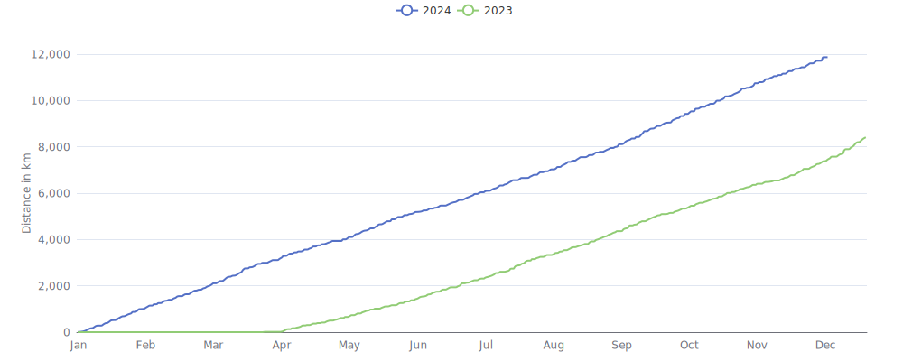

    

Since I began cycling `1 year and 10 months` ago on `27-03-2023`,
I had `470 cycling days`. 
I recorded a total distance of `19 536 km`
(`0.49` trips around the world 🌍 and
`0.051` trips to the moon 🌕),
an elevation of `123 499 m`
(`14.0` times Mount Everest 🏔)
and a total time of `3w 6d 16h 23m` 🎉

That's a daily average of `32 km`,
a weekly average of `222 km` and a
monthly average of `930 km` 🐣

I burned `399266 calories` doing so, that's about `1 479` pizza slices 🍕

---

<kbd><a href="#weekly-distances">Weekly distances</a></kbd> |
<kbd><a href="#activities">Activities</a></kbd> |
<kbd><a href="#monthly-stats">Monthly stats</a></kbd> |
<kbd><a href="#activity-intensity">Activity intensity</a></kbd> |
<kbd><a href="#stats-per-weekday">Stats per weekday</a></kbd> |
<kbd><a href="#daytime-stats">Daytime stats</a></kbd> |
<kbd><a href="#stats-per-bike">Stats per bike</a></kbd> |
<kbd><a href="#best-power-outputs-over-time">Power outputs</a></kbd> |
<kbd><a href="#eddington-chart">Eddington</a></kbd> |
<kbd><a href="#yearly-distances">Yearly distances</a></kbd> |
<kbd><a href="#distance-breakdown">Distance breakdown</a></kbd> |
<kbd><a href="#challenge-consistency">Challenge consistency</a></kbd> |
<kbd><a href="#completed-challenges">Completed challenges</a></kbd>

## Weekly distances

## Activities

<table>
    <tr>
        <th></th>
        <th></th>
        <th align="center"></th>
        <th align="center"></th>
        <th align="center"></th>
        <th align="center"></th>
        <th align="center"></th>
        <th align="center"></th>
    </tr>
            <tr>
            <td>01-12-24</td>
            <td>
                                
<a href="https://www.strava.com/activities/13022198497" title="Kcal: 553 | Gear: Zwift Ride w/ Zwift Hub ">Zwift Camp: Baseline | Att...</a>
            </td>
            <td align="center">33 km</td>
            <td align="center">53 m</td>
            <td align="center">53:23</td>
            <td align="center">181 w</td>
            <td align="center">37.1 km/h</td>
            <td align="center">155</td>
        </tr>
            <tr>
            <td>29-11-24</td>
            <td>
                                
<a href="https://www.strava.com/activities/13010187231" title="Kcal: 374 | Gear: Zwift Ride w/ Zwift Hub ">Zone 2 in Watopia</a>
            </td>
            <td align="center">22 km</td>
            <td align="center">33 m</td>
            <td align="center">35:21</td>
            <td align="center">185 w</td>
            <td align="center">37.3 km/h</td>
            <td align="center">140</td>
        </tr>
            <tr>
            <td>29-11-24</td>
            <td>
                                
<a href="https://www.strava.com/activities/13009960801" title="Kcal: 324 | Gear: Zwift Ride w/ Zwift Hub ">Zwift Camp: Baseline | Spr...</a>
            </td>
            <td align="center">21 km</td>
            <td align="center">33 m</td>
            <td align="center">34:29</td>
            <td align="center">165 w</td>
            <td align="center">36.3 km/h</td>
            <td align="center">137</td>
        </tr>
            <tr>
            <td>28-11-24</td>
            <td>
                                
<a href="https://www.strava.com/activities/13003654100" title="Kcal: 949 | Gear: Zwift Ride w/ Zwift Hub ">Zone 2 in Watopia</a>
            </td>
            <td align="center">58 km</td>
            <td align="center">91 m</td>
            <td align="center">1:30:18</td>
            <td align="center">183 w</td>
            <td align="center">38.7 km/h</td>
            <td align="center">144</td>
        </tr>
            <tr>
            <td>26-11-24</td>
            <td>
                                
<a href="https://www.strava.com/activities/12988585571" title="Kcal: 962 | Gear: Zwift Ride w/ Zwift Hub ">Zone 2 in Watopia</a>
            </td>
            <td align="center">55 km</td>
            <td align="center">317 m</td>
            <td align="center">1:30:18</td>
            <td align="center">186 w</td>
            <td align="center">36.6 km/h</td>
            <td align="center">144</td>
        </tr>
        </table>

    
Older activities

    <table>
        <tr>
            <th></th>
            <th></th>
            <th align="center"></th>
            <th align="center"></th>
            <th align="center"></th>
            <th align="center"></th>
            <th align="center"></th>
            <th align="center"></th>
        </tr>
                    <tr>
                <td>25-11-24</td>
                <td>
                                    
<a href="https://www.strava.com/activities/12981255655" title="Kcal: 330 | Gear: Zwift Ride w/ Zwift Hub ">Zone 2 in Watopia</a>
                </td>
                <td align="center">22 km</td>
                <td align="center">33 m</td>
                <td align="center">35:11</td>
                <td align="center">164 w</td>
                <td align="center">36.8 km/h</td>
                <td align="center">136</td>
            </tr>
                    <tr>
                <td>25-11-24</td>
                <td>
                                    
<a href="https://www.strava.com/activities/12980997614" title="Kcal: 572 | Gear: Zwift Ride w/ Zwift Hub ">Zwift Camp: Baseline | Spr...</a>
                </td>
                <td align="center">33 km</td>
                <td align="center">133 m</td>
                <td align="center">56:06</td>
                <td align="center">178 w</td>
                <td align="center">35.7 km/h</td>
                <td align="center">144</td>
            </tr>
                    <tr>
                <td>23-11-24</td>
                <td>
                                    
<a href="https://www.strava.com/activities/12964102441" title="Kcal: 904 | Gear: Zwift Ride w/ Zwift Hub ">Zone 2 in Watopia</a>
                </td>
                <td align="center">56 km</td>
                <td align="center">85 m</td>
                <td align="center">1:30:50</td>
                <td align="center">174 w</td>
                <td align="center">37.2 km/h</td>
                <td align="center">146</td>
            </tr>
                    <tr>
                <td>21-11-24</td>
                <td>
                                    
<a href="https://www.strava.com/activities/12952808535" title="Kcal: 30 | Gear: Zwift Ride w/ Zwift Hub ">Zone 2 in Watopia</a>
                </td>
                <td align="center">3 km</td>
                <td align="center">10 m</td>
                <td align="center">5:36</td>
                <td align="center">96 w</td>
                <td align="center">31 km/h</td>
                <td align="center">155</td>
            </tr>
                    <tr>
                <td>21-11-24</td>
                <td>
                                    
<a href="https://www.strava.com/activities/12952767392" title="Kcal: 819 | Gear: Zwift Ride w/ Zwift Hub ">Race: Tofu Tornado Race (C...</a>
                </td>
                <td align="center">39 km</td>
                <td align="center">260 m</td>
                <td align="center">1:00:52</td>
                <td align="center">232 w</td>
                <td align="center">38.9 km/h</td>
                <td align="center">181</td>
            </tr>
                    <tr>
                <td>21-11-24</td>
                <td>
                                    
<a href="https://www.strava.com/activities/12952375698" title="Kcal: 91 | Gear: Zwift Ride w/ Zwift Hub ">Warm Up in Watopia</a>
                </td>
                <td align="center">6 km</td>
                <td align="center">28 m</td>
                <td align="center">11:01</td>
                <td align="center">146 w</td>
                <td align="center">31.3 km/h</td>
                <td align="center">143</td>
            </tr>
                    <tr>
                <td>19-11-24</td>
                <td>
                                    
<a href="https://www.strava.com/activities/12937496244" title="Kcal: 446 | Gear: Zwift Ride w/ Zwift Hub ">Zone 2 in Watopia</a>
                </td>
                <td align="center">25 km</td>
                <td align="center">159 m</td>
                <td align="center">40:21</td>
                <td align="center">193 w</td>
                <td align="center">36.5 km/h</td>
                <td align="center">149</td>
            </tr>
                    <tr>
                <td>19-11-24</td>
                <td>
                                    
<a href="https://www.strava.com/activities/12937242168" title="Kcal: 452 | Gear: Zwift Ride w/ Zwift Hub ">Zone 2 in Watopia</a>
                </td>
                <td align="center">25 km</td>
                <td align="center">217 m</td>
                <td align="center">45:29</td>
                <td align="center">175 w</td>
                <td align="center">33.1 km/h</td>
                <td align="center">153</td>
            </tr>
                    <tr>
                <td>18-11-24</td>
                <td>
                                    
<a href="https://www.strava.com/activities/12929923778" title="Kcal: 155 | Gear: Zwift Ride w/ Zwift Hub ">The Classic in Watopia</a>
                </td>
                <td align="center">9 km</td>
                <td align="center">65 m</td>
                <td align="center">15:57</td>
                <td align="center">170 w</td>
                <td align="center">34.3 km/h</td>
                <td align="center">146</td>
            </tr>
                    <tr>
                <td>18-11-24</td>
                <td>
                                    
<a href="https://www.strava.com/activities/12929821845" title="Kcal: 38 | Gear: Zwift Ride w/ Zwift Hub ">Repack Rush in Watopia</a>
                </td>
                <td align="center">3 km</td>
                <td align="center">27 m</td>
                <td align="center">4:07</td>
                <td align="center">166 w</td>
                <td align="center">40.5 km/h</td>
                <td align="center">153</td>
            </tr>
                    <tr>
                <td>18-11-24</td>
                <td>
                                    
<a href="https://www.strava.com/activities/12929790789" title="Kcal: 362 | Gear: Zwift Ride w/ Zwift Hub ">Loopin Lava in Watopia</a>
                </td>
                <td align="center">18 km</td>
                <td align="center">212 m</td>
                <td align="center">31:37</td>
                <td align="center">200 w</td>
                <td align="center">35 km/h</td>
                <td align="center">157</td>
            </tr>
                    <tr>
                <td>17-11-24</td>
                <td>
                                    
<a href="https://www.strava.com/activities/12920759695" title="Kcal: 983 | Gear: Zwift Ride w/ Zwift Hub ">Group Ride: Long | Stage 5...</a>
                </td>
                <td align="center">53 km</td>
                <td align="center">501 m</td>
                <td align="center">1:33:51</td>
                <td align="center">178 w</td>
                <td align="center">33.7 km/h</td>
                <td align="center">152</td>
            </tr>
                    <tr>
                <td>15-11-24</td>
                <td>
                    
<a href="https://www.strava.com/activities/12907711505" title="Kcal: 1126 | Gear: Canyon Endurace CF 8 Di2 ">💼 ➡️ 🏠</a>
                </td>
                <td align="center">46 km</td>
                <td align="center">68 m</td>
                <td align="center">1:36:42</td>
                <td align="center">173 w</td>
                <td align="center">28.2 km/h</td>
                <td align="center">148</td>
            </tr>
                    <tr>
                <td>15-11-24</td>
                <td>
                    
<a href="https://www.strava.com/activities/12904047903" title="Kcal: 1067 | Gear: Canyon Endurace CF 8 Di2 ">🏠 ➡️ 💼</a>
                </td>
                <td align="center">46 km</td>
                <td align="center">85 m</td>
                <td align="center">1:41:03</td>
                <td align="center">158 w</td>
                <td align="center">27 km/h</td>
                <td align="center">153</td>
            </tr>
                    <tr>
                <td>14-11-24</td>
                <td>
                                    
<a href="https://www.strava.com/activities/12899834682" title="Kcal: 659 | Gear: Zwift Ride w/ Zwift Hub ">Group Ride: Standard | Sta...</a>
                </td>
                <td align="center">36 km</td>
                <td align="center">186 m</td>
                <td align="center">1:00:32</td>
                <td align="center">174 w</td>
                <td align="center">35.8 km/h</td>
                <td align="center">155</td>
            </tr>
                    <tr>
                <td>12-11-24</td>
                <td>
                                    
<a href="https://www.strava.com/activities/12884442362" title="Kcal: 756 | Gear: Zwift Ride w/ Zwift Hub ">Zone 2 in Watopia</a>
                </td>
                <td align="center">49 km</td>
                <td align="center">74 m</td>
                <td align="center">1:15:23</td>
                <td align="center">175 w</td>
                <td align="center">38.9 km/h</td>
                <td align="center">145</td>
            </tr>
                    <tr>
                <td>10-11-24</td>
                <td>
                    
<a href="https://www.strava.com/activities/12867927415" title="Kcal: 2496 | Gear: Canyon Endurace CF 8 Di2 ">Op z&#039;n zondags</a>
                </td>
                <td align="center">104 km</td>
                <td align="center">211 m</td>
                <td align="center">3:51:52</td>
                <td align="center">158 w</td>
                <td align="center">27 km/h</td>
                <td align="center">143</td>
            </tr>
                    <tr>
                <td>09-11-24</td>
                <td>
                                    
<a href="https://www.strava.com/activities/12859544966" title="Kcal: 921 | Gear: Zwift Ride w/ Zwift Hub ">Zone 2 in Watopia</a>
                </td>
                <td align="center">49 km</td>
                <td align="center">398 m</td>
                <td align="center">1:30:08</td>
                <td align="center">179 w</td>
                <td align="center">32.7 km/h</td>
                <td align="center">145</td>
            </tr>
                    <tr>
                <td>08-11-24</td>
                <td>
                                    
<a href="https://www.strava.com/activities/12852898837" title="Kcal: 643 | Gear: Zwift Ride w/ Zwift Hub ">Zone 2 in Watopia</a>
                </td>
                <td align="center">41 km</td>
                <td align="center">64 m</td>
                <td align="center">1:05:21</td>
                <td align="center">172 w</td>
                <td align="center">37.4 km/h</td>
                <td align="center">141</td>
            </tr>
                    <tr>
                <td>07-11-24</td>
                <td>
                    
<a href="https://www.strava.com/activities/12842575076" title="Kcal: 64 | Gear: City bike ">💼</a>
                </td>
                <td align="center">5 km</td>
                <td align="center">18 m</td>
                <td align="center">18:38</td>
                <td align="center">51 w</td>
                <td align="center">17.1 km/h</td>
                <td align="center">111</td>
            </tr>
                    <tr>
                <td>06-11-24</td>
                <td>
                                    
<a href="https://www.strava.com/activities/12837970901" title="Kcal: 114 | Gear: Zwift Ride w/ Zwift Hub ">Zone 2 in Watopia</a>
                </td>
                <td align="center">9 km</td>
                <td align="center">12 m</td>
                <td align="center">15:15</td>
                <td align="center">130 w</td>
                <td align="center">34.1 km/h</td>
                <td align="center">147</td>
            </tr>
                    <tr>
                <td>06-11-24</td>
                <td>
                                    
<a href="https://www.strava.com/activities/12837856497" title="Kcal: 431 | Gear: Zwift Ride w/ Zwift Hub ">Group Ride: Short | Stage ...</a>
                </td>
                <td align="center">19 km</td>
                <td align="center">70 m</td>
                <td align="center">26:04</td>
                <td align="center">253 w</td>
                <td align="center">44 km/h</td>
                <td align="center">179</td>
            </tr>
                    <tr>
                <td>04-11-24</td>
                <td>
                    
<a href="https://www.strava.com/activities/12821977368" title="Kcal: 1182 | Gear: Canyon Endurace CF 8 Di2 ">💼 ➡️ 🏠</a>
                </td>
                <td align="center">46 km</td>
                <td align="center">69 m</td>
                <td align="center">1:29:52</td>
                <td align="center">196 w</td>
                <td align="center">30.5 km/h</td>
                <td align="center">156</td>
            </tr>
                    <tr>
                <td>04-11-24</td>
                <td>
                    
<a href="https://www.strava.com/activities/12818412980" title="Kcal: 1175 | Gear: Canyon Endurace CF 8 Di2 ">🏠 ➡️ 💼</a>
                </td>
                <td align="center">46 km</td>
                <td align="center">123 m</td>
                <td align="center">1:40:05</td>
                <td align="center">175 w</td>
                <td align="center">27.3 km/h</td>
                <td align="center">143</td>
            </tr>
                    <tr>
                <td>03-11-24</td>
                <td>
                    
<a href="https://www.strava.com/activities/12815632248" title="Kcal: 234 | Gear: Retro Race Bike ">👶🏻 - bezoek</a>
                </td>
                <td align="center">10 km</td>
                <td align="center">18 m</td>
                <td align="center">32:04</td>
                <td align="center">49 w</td>
                <td align="center">18.4 km/h</td>
                <td align="center">112</td>
            </tr>
                    <tr>
                <td>03-11-24</td>
                <td>
                                    
<a href="https://www.strava.com/activities/12812940039" title="Kcal: 943 | Gear: Zwift Ride w/ Zwift Hub ">Zone 2 in Watopia</a>
                </td>
                <td align="center">57 km</td>
                <td align="center">86 m</td>
                <td align="center">1:31:02</td>
                <td align="center">181 w</td>
                <td align="center">37.4 km/h</td>
                <td align="center">137</td>
            </tr>
                    <tr>
                <td>02-11-24</td>
                <td>
                                    
<a href="https://www.strava.com/activities/12805582920" title="Kcal: 298 | Gear: Zwift Ride w/ Zwift Hub ">Cooldown in Watopia</a>
                </td>
                <td align="center">21 km</td>
                <td align="center">33 m</td>
                <td align="center">35:21</td>
                <td align="center">147 w</td>
                <td align="center">35 km/h</td>
                <td align="center">145</td>
            </tr>
                    <tr>
                <td>02-11-24</td>
                <td>
                                    
<a href="https://www.strava.com/activities/12805242022" title="Kcal: 506 | Gear: Zwift Ride w/ Zwift Hub ">Group Ride: Standard | Sta...</a>
                </td>
                <td align="center">23 km</td>
                <td align="center">181 m</td>
                <td align="center">31:57</td>
                <td align="center">260 w</td>
                <td align="center">42.5 km/h</td>
                <td align="center">181</td>
            </tr>
                    <tr>
                <td>01-11-24</td>
                <td>
                                    
<a href="https://www.strava.com/activities/12798560759" title="Kcal: 700 | Gear: Zwift Ride w/ Zwift Hub ">Zone 2 in Scotland</a>
                </td>
                <td align="center">39 km</td>
                <td align="center">420 m</td>
                <td align="center">1:15:08</td>
                <td align="center">163 w</td>
                <td align="center">31.5 km/h</td>
                <td align="center">142</td>
            </tr>
                    <tr>
                <td>31-10-24</td>
                <td>
                                    
<a href="https://www.strava.com/activities/12791200513" title="Kcal: 942 | Gear: Zwift Ride w/ Zwift Hub ">Eastern Eight in Watopia</a>
                </td>
                <td align="center">52 km</td>
                <td align="center">407 m</td>
                <td align="center">1:26:42</td>
                <td align="center">190 w</td>
                <td align="center">36.1 km/h</td>
                <td align="center">149</td>
            </tr>
                    <tr>
                <td>30-10-24</td>
                <td>
                                    
<a href="https://www.strava.com/activities/12783062567" title="Kcal: 281 | Gear: Zwift Ride w/ Zwift Hub ">Zone 2 in Watopia</a>
                </td>
                <td align="center">19 km</td>
                <td align="center">31 m</td>
                <td align="center">32:09</td>
                <td align="center">153 w</td>
                <td align="center">35.7 km/h</td>
                <td align="center">137</td>
            </tr>
                    <tr>
                <td>29-10-24</td>
                <td>
                    
<a href="https://www.strava.com/activities/12775045798" title="Kcal: 604 | Gear: Cyclo Studio Bike ">Cyclo Studio 🎃👻</a>
                </td>
                <td align="center">24 km</td>
                <td align="center">0 m</td>
                <td align="center">40:25</td>
                <td align="center">224 w</td>
                <td align="center">35.4 km/h</td>
                <td align="center">n/a</td>
            </tr>
                    <tr>
                <td>29-10-24</td>
                <td>
                    
<a href="https://www.strava.com/activities/12771038640" title="Kcal: 64 | Gear: City bike ">💼</a>
                </td>
                <td align="center">5 km</td>
                <td align="center">19 m</td>
                <td align="center">18:38</td>
                <td align="center">51 w</td>
                <td align="center">17.1 km/h</td>
                <td align="center">111</td>
            </tr>
                    <tr>
                <td>27-10-24</td>
                <td>
                    
<a href="https://www.strava.com/activities/12759834815" title="Kcal: 2159 | Gear: Diamond Road Bike ☠️ ">Op z&#039;n zondags</a>
                </td>
                <td align="center">89 km</td>
                <td align="center">139 m</td>
                <td align="center">3:18:43</td>
                <td align="center">160 w</td>
                <td align="center">26.9 km/h</td>
                <td align="center">134</td>
            </tr>
                    <tr>
                <td>27-10-24</td>
                <td>
                    
<a href="https://www.strava.com/activities/12756777248" title="Kcal: 215 | Gear: Retro Race Bike ">Morning Ride</a>
                </td>
                <td align="center">9 km</td>
                <td align="center">26 m</td>
                <td align="center">31:56</td>
                <td align="center">50 w</td>
                <td align="center">17.6 km/h</td>
                <td align="center">105</td>
            </tr>
                    <tr>
                <td>26-10-24</td>
                <td>
                                    
<a href="https://www.strava.com/activities/12749333983" title="Kcal: 822 | Gear: Zwift Ride w/ Zwift Hub ">Richmond Loop Around in Ri...</a>
                </td>
                <td align="center">43 km</td>
                <td align="center">556 m</td>
                <td align="center">1:24:42</td>
                <td align="center">169 w</td>
                <td align="center">30.2 km/h</td>
                <td align="center">151</td>
            </tr>
                    <tr>
                <td>25-10-24</td>
                <td>
                                    
<a href="https://www.strava.com/activities/12743718259" title="Kcal: 702 | Gear: Zwift Ride w/ Zwift Hub ">Zone 2 in Watopia</a>
                </td>
                <td align="center">42 km</td>
                <td align="center">65 m</td>
                <td align="center">1:10:16</td>
                <td align="center">174 w</td>
                <td align="center">36.2 km/h</td>
                <td align="center">153</td>
            </tr>
                    <tr>
                <td>23-10-24</td>
                <td>
                    
<a href="https://www.strava.com/activities/12726463599" title="Kcal: 1132 | Gear: Diamond Road Bike ☠️ ">💼 ➡️ 🏠</a>
                </td>
                <td align="center">45 km</td>
                <td align="center">66 m</td>
                <td align="center">1:31:49</td>
                <td align="center">183 w</td>
                <td align="center">29.7 km/h</td>
                <td align="center">152</td>
            </tr>
                    <tr>
                <td>23-10-24</td>
                <td>
                    
<a href="https://www.strava.com/activities/12722819228" title="Kcal: 1154 | Gear: Diamond Road Bike ☠️ ">🏠 ➡️ 💼</a>
                </td>
                <td align="center">45 km</td>
                <td align="center">73 m</td>
                <td align="center">1:38:08</td>
                <td align="center">173 w</td>
                <td align="center">27.8 km/h</td>
                <td align="center">156</td>
            </tr>
                    <tr>
                <td>22-10-24</td>
                <td>
                                    
<a href="https://www.strava.com/activities/12718374926" title="Kcal: 413 | Gear: Zwift Ride w/ Zwift Hub ">Zone 2 in Watopia</a>
                </td>
                <td align="center">26 km</td>
                <td align="center">39 m</td>
                <td align="center">40:28</td>
                <td align="center">178 w</td>
                <td align="center">38.4 km/h</td>
                <td align="center">137</td>
            </tr>
                    <tr>
                <td>22-10-24</td>
                <td>
                                    
<a href="https://www.strava.com/activities/12717944447" title="Kcal: 260 | Gear: Zwift Ride w/ Zwift Hub ">Jungle Circuit in Watopia</a>
                </td>
                <td align="center">14 km</td>
                <td align="center">105 m</td>
                <td align="center">27:10</td>
                <td align="center">167 w</td>
                <td align="center">31.1 km/h</td>
                <td align="center">133</td>
            </tr>
                    <tr>
                <td>22-10-24</td>
                <td>
                    
<a href="https://www.strava.com/activities/12718485286" title="Kcal: 64 | Gear: City bike ">💼</a>
                </td>
                <td align="center">5 km</td>
                <td align="center">19 m</td>
                <td align="center">18:38</td>
                <td align="center">51 w</td>
                <td align="center">17.1 km/h</td>
                <td align="center">111</td>
            </tr>
                    <tr>
                <td>20-10-24</td>
                <td>
                                    
<a href="https://www.strava.com/activities/12700483674" title="Kcal: 140 | Gear: Zwift Ride w/ Zwift Hub ">Cooldown in Watopia</a>
                </td>
                <td align="center">8 km</td>
                <td align="center">46 m</td>
                <td align="center">16:19</td>
                <td align="center">150 w</td>
                <td align="center">30.8 km/h</td>
                <td align="center">143</td>
            </tr>
                    <tr>
                <td>20-10-24</td>
                <td>
                                    
<a href="https://www.strava.com/activities/12700324352" title="Kcal: 503 | Gear: Zwift Ride w/ Zwift Hub ">Race: Community Racing Fes...</a>
                </td>
                <td align="center">23 km</td>
                <td align="center">183 m</td>
                <td align="center">33:52</td>
                <td align="center">253 w</td>
                <td align="center">41.6 km/h</td>
                <td align="center">180</td>
            </tr>
                    <tr>
                <td>20-10-24</td>
                <td>
                                    
<a href="https://www.strava.com/activities/12699967134" title="Kcal: 121 | Gear: Zwift Ride w/ Zwift Hub ">Warm Up in Watopia</a>
                </td>
                <td align="center">8 km</td>
                <td align="center">33 m</td>
                <td align="center">14:18</td>
                <td align="center">149 w</td>
                <td align="center">32.2 km/h</td>
                <td align="center">141</td>
            </tr>
                    <tr>
                <td>19-10-24</td>
                <td>
                                    
<a href="https://www.strava.com/activities/12692420854" title="Kcal: 696 | Gear: Zwift Ride w/ Zwift Hub ">Group Ride: Short | Stage ...</a>
                </td>
                <td align="center">36 km</td>
                <td align="center">298 m</td>
                <td align="center">1:02:14</td>
                <td align="center">174 w</td>
                <td align="center">34.3 km/h</td>
                <td align="center">147</td>
            </tr>
                    <tr>
                <td>18-10-24</td>
                <td>
                    
<a href="https://www.strava.com/activities/12689891246" title="Kcal: 108 | Gear: City bike ">Evening Ride</a>
                </td>
                <td align="center">7 km</td>
                <td align="center">10 m</td>
                <td align="center">22:07</td>
                <td align="center">52 w</td>
                <td align="center">19.3 km/h</td>
                <td align="center">94</td>
            </tr>
                    <tr>
                <td>18-10-24</td>
                <td>
                                    
<a href="https://www.strava.com/activities/12685900942" title="Kcal: 759 | Gear: Zwift Ride w/ Zwift Hub ">Zone 2 in Watopia</a>
                </td>
                <td align="center">49 km</td>
                <td align="center">79 m</td>
                <td align="center">1:24:04</td>
                <td align="center">158 w</td>
                <td align="center">35.3 km/h</td>
                <td align="center">137</td>
            </tr>
                    <tr>
                <td>16-10-24</td>
                <td>
                                    
<a href="https://www.strava.com/activities/12670458885" title="Kcal: 617 | Gear: Zwift Ride w/ Zwift Hub ">Group Ride: Standard | Sta...</a>
                </td>
                <td align="center">36 km</td>
                <td align="center">278 m</td>
                <td align="center">1:00:31</td>
                <td align="center">173 w</td>
                <td align="center">35.3 km/h</td>
                <td align="center">149</td>
            </tr>
                    <tr>
                <td>15-10-24</td>
                <td>
                                    
<a href="https://www.strava.com/activities/12662652069" title="Kcal: 782 | Gear: Zwift Ride w/ Zwift Hub ">Group Ride: Long | Stage 1...</a>
                </td>
                <td align="center">30 km</td>
                <td align="center">678 m</td>
                <td align="center">54:40</td>
                <td align="center">236 w</td>
                <td align="center">32.6 km/h</td>
                <td align="center">177</td>
            </tr>
            </table>

## Monthly stats

<table>
    <thead>
    <tr>
        <th>&nbsp;&nbsp;&nbsp;&nbsp;&nbsp;</th>
        <th># of rides</th>
        <th align="center"></th>
        <th align="center"></th>
        <th align="center"></th>
        <th align="center"></th>
    </tr>
    </thead>
    <tbody>
            <tr>
            <td align="center">December 2024</td>
            <td align="center">1</td>
            <td align="center">33 km</td>
            <td align="center">53 m</td>
            <td align="center">53m</td>
            <td align="center">0</td>
        </tr>
            <tr>
            <td align="center">November 2024</td>
            <td align="center">33</td>
            <td align="center">1 092 km</td>
            <td align="center">4 320 m</td>
            <td align="center">1d 8h 57m</td>
            <td align="center">12</td>
        </tr>
            <tr>
            <td align="center">October 2024</td>
            <td align="center">42</td>
            <td align="center">1 234 km</td>
            <td align="center">4 969 m</td>
            <td align="center">1d 17h</td>
            <td align="center">27</td>
        </tr>
            <tr>
            <td align="center">September 2024</td>
            <td align="center">32</td>
            <td align="center">1 254 km</td>
            <td align="center">10 479 m</td>
            <td align="center">1d 19h 54m</td>
            <td align="center">29</td>
        </tr>
            <tr>
            <td align="center">August 2024</td>
            <td align="center">21</td>
            <td align="center">992 km</td>
            <td align="center">5 215 m</td>
            <td align="center">1d 8h 17m</td>
            <td align="center">17</td>
        </tr>
            <tr>
            <td align="center">July 2024</td>
            <td align="center">28</td>
            <td align="center">924 km</td>
            <td align="center">3 371 m</td>
            <td align="center">1d 4h 39m</td>
            <td align="center">22</td>
        </tr>
            <tr>
            <td align="center">June 2024</td>
            <td align="center">28</td>
            <td align="center">777 km</td>
            <td align="center">6 009 m</td>
            <td align="center">1d 3h 5m</td>
            <td align="center">17</td>
        </tr>
            <tr>
            <td align="center">May 2024</td>
            <td align="center">28</td>
            <td align="center">1 118 km</td>
            <td align="center">2 836 m</td>
            <td align="center">1d 12h 8m</td>
            <td align="center">28</td>
        </tr>
            <tr>
            <td align="center">April 2024</td>
            <td align="center">27</td>
            <td align="center">825 km</td>
            <td align="center">3 462 m</td>
            <td align="center">1d 3h 16m</td>
            <td align="center">24</td>
        </tr>
            <tr>
            <td align="center">March 2024</td>
            <td align="center">47</td>
            <td align="center">1 139 km</td>
            <td align="center">6 478 m</td>
            <td align="center">1d 13h 19m</td>
            <td align="center">25</td>
        </tr>
            <tr>
            <td align="center">February 2024</td>
            <td align="center">37</td>
            <td align="center">888 km</td>
            <td align="center">5 019 m</td>
            <td align="center">1d 4h 50m</td>
            <td align="center">10</td>
        </tr>
            <tr>
            <td align="center">January 2024</td>
            <td align="center">45</td>
            <td align="center">999 km</td>
            <td align="center">6 511 m</td>
            <td align="center">1d 9h 3m</td>
            <td align="center">21</td>
        </tr>
            <tr>
            <td align="center">December 2023</td>
            <td align="center">38</td>
            <td align="center">1 478 km</td>
            <td align="center">9 164 m</td>
            <td align="center">1d 23h 41m</td>
            <td align="center">12</td>
        </tr>
            <tr>
            <td align="center">November 2023</td>
            <td align="center">30</td>
            <td align="center">828 km</td>
            <td align="center">4 113 m</td>
            <td align="center">1d 2h 45m</td>
            <td align="center">11</td>
        </tr>
            <tr>
            <td align="center">October 2023</td>
            <td align="center">35</td>
            <td align="center">930 km</td>
            <td align="center">8 462 m</td>
            <td align="center">1d 7h 32m</td>
            <td align="center">18</td>
        </tr>
            <tr>
            <td align="center">September 2023</td>
            <td align="center">30</td>
            <td align="center">1 016 km</td>
            <td align="center">6 410 m</td>
            <td align="center">1d 10h 29m</td>
            <td align="center">20</td>
        </tr>
            <tr>
            <td align="center">August 2023</td>
            <td align="center">26</td>
            <td align="center">885 km</td>
            <td align="center">9 813 m</td>
            <td align="center">1d 10h 9m</td>
            <td align="center">19</td>
        </tr>
            <tr>
            <td align="center">July 2023</td>
            <td align="center">31</td>
            <td align="center">1 016 km</td>
            <td align="center">6 634 m</td>
            <td align="center">1d 12h 42m</td>
            <td align="center">20</td>
        </tr>
            <tr>
            <td align="center">June 2023</td>
            <td align="center">28</td>
            <td align="center">839 km</td>
            <td align="center">9 384 m</td>
            <td align="center">1d 10h 13m</td>
            <td align="center">22</td>
        </tr>
            <tr>
            <td align="center">May 2023</td>
            <td align="center">32</td>
            <td align="center">722 km</td>
            <td align="center">7 242 m</td>
            <td align="center">1d 4h 1m</td>
            <td align="center">10</td>
        </tr>
            <tr>
            <td align="center">April 2023</td>
            <td align="center">24</td>
            <td align="center">535 km</td>
            <td align="center">3 530 m</td>
            <td align="center">20h 21m</td>
            <td align="center">7</td>
        </tr>
            <tr>
            <td align="center">March 2023</td>
            <td align="center">2</td>
            <td align="center">12 km</td>
            <td align="center">27 m</td>
            <td align="center">59m</td>
            <td align="center">0</td>
        </tr>
        <tr>
        <td align="center"><b>Virtual/Indoor</b></td>
        <td align="center"><b>403</td>
        <td align="center"><b>13 713 km</b></td>
        <td align="center"><b>100 469 m</b></td>
        <td align="center"><b>2w 3d 17h 34m</b></td>
        <td align="center"></td>
    </tr>
    <tr>
        <td align="center"><b>Outside</b></td>
        <td align="center"><b>242</td>
        <td align="center"><b>5 824 km</b></td>
        <td align="center"><b>23 030 m</b></td>
        <td align="center"><b>1w 2d 22h 49m</b></td>
        <td align="center"></td>
    </tr>
    <tr>
        <td align="center"><b>Total</b></td>
        <td align="center"><b>645</td>
        <td align="center"><b>19 536 km</b></td>
        <td align="center"><b>123 499 m</b></td>
        <td align="center"><b>3w 6d 16h 23m</b></td>
        <td align="center"></td>
    </tr>
    </tbody>
</table>

## Activity intensity

## Stats per weekday

<table>
    <thead>
    <tr>
        <th></th>
        <th># of rides</th>
        <th align="center"></th>
        <th align="center"></th>
        <th align="center"></th>
        <th align="center"></th>
    </tr>
    </thead>
    <tbody>
            <tr>
            <td align="center">Monday</td>
            <td align="center">75</td>
            <td align="center">
                                    27 km avg /
                    2 031 km total
                            </td>
            <td align="center">13 593 m</td>
            <td align="center">2d 22h 9m</td>
            <td align="center">28.9 km/h</td>
        </tr>
            <tr>
            <td align="center">Tuesday</td>
            <td align="center">93</td>
            <td align="center">
                                    32 km avg /
                    2 946 km total
                            </td>
            <td align="center">18 463 m</td>
            <td align="center">4d 43m</td>
            <td align="center">30.5 km/h</td>
        </tr>
            <tr>
            <td align="center">Wednesday</td>
            <td align="center">104</td>
            <td align="center">
                                    30 km avg /
                    3 069 km total
                            </td>
            <td align="center">18 943 m</td>
            <td align="center">4d 10h 14m</td>
            <td align="center">28.9 km/h</td>
        </tr>
            <tr>
            <td align="center">Thursday</td>
            <td align="center">88</td>
            <td align="center">
                                    28 km avg /
                    2 482 km total
                            </td>
            <td align="center">19 898 m</td>
            <td align="center">3d 13h 56m</td>
            <td align="center">28.9 km/h</td>
        </tr>
            <tr>
            <td align="center">Friday</td>
            <td align="center">107</td>
            <td align="center">
                                    27 km avg /
                    2 912 km total
                            </td>
            <td align="center">19 251 m</td>
            <td align="center">4d 3h 39m</td>
            <td align="center">29.2 km/h</td>
        </tr>
            <tr>
            <td align="center">Saturday</td>
            <td align="center">92</td>
            <td align="center">
                                    31 km avg /
                    2 807 km total
                            </td>
            <td align="center">18 166 m</td>
            <td align="center">4d 27m</td>
            <td align="center">29.1 km/h</td>
        </tr>
            <tr>
            <td align="center">Sunday</td>
            <td align="center">86</td>
            <td align="center">
                                    38 km avg /
                    3 288 km total
                            </td>
            <td align="center">15 186 m</td>
            <td align="center">4d 13h 11m</td>
            <td align="center">30.1 km/h</td>
        </tr>
        </tbody>
</table>

## Daytime stats

<table>
    <thead>
    <tr>
        <th></th>
        <th># of rides</th>
        <th align="center"></th>
        <th align="center"></th>
        <th align="center"></th>
        <th align="center"></th>
    </tr>
    </thead>
    <tbody>
            <tr>
            <td align="center">Morning (6h - 12h)</td>
            <td align="center">141</td>
            <td align="center">
                                    29 km avg /
                    4 142 km total
                            </td>
            <td align="center">27 545 m</td>
            <td align="center">6d 17h 42m</td>
            <td align="center">25.6 km/h</td>
        </tr>
            <tr>
            <td align="center">Afternoon (12h - 17h)</td>
            <td align="center">307</td>
            <td align="center">
                                    35 km avg /
                    10 654 km total
                            </td>
            <td align="center">67 402 m</td>
            <td align="center">2w 10h 35m</td>
            <td align="center">30.7 km/h</td>
        </tr>
            <tr>
            <td align="center">Evening (17h - 23h)</td>
            <td align="center">189</td>
            <td align="center">
                                    24 km avg /
                    4 579 km total
                            </td>
            <td align="center">28 217 m</td>
            <td align="center">6d 5h 45m</td>
            <td align="center">30.6 km/h</td>
        </tr>
            <tr>
            <td align="center">Night (23h - 6h)</td>
            <td align="center">8</td>
            <td align="center">
                                    20 km avg /
                    161 km total
                            </td>
            <td align="center">334 m</td>
            <td align="center">6h 20m</td>
            <td align="center">25.4 km/h</td>
        </tr>
        </tbody>
</table>

## Stats per bike

<table>
    <thead>
    <tr>
        <th></th>
        <th># of rides</th>
        <th align="center"></th>
        <th align="center"></th>
        <th align="center"></th>
        <th align="center"></th>
    </tr>
    </thead>
    <tbody>
            <tr>
            <td align="center">Retro Race Bike</td>
            <td align="center">83</td>
            <td align="center">
                                    35 km avg /
                    2 873 km total
                            </td>
            <td align="center">9 260 m</td>
            <td align="center">4d 16h 58m</td>
            <td align="center">25.4 km/h</td>
        </tr>
            <tr>
            <td align="center">Zwift Ride w/ Zwift Hub</td>
            <td align="center">64</td>
            <td align="center">
                                    30 km avg /
                    1 904 km total
                            </td>
            <td align="center">9 983 m</td>
            <td align="center">2d 5h 30m</td>
            <td align="center">35.6 km/h</td>
        </tr>
            <tr>
            <td align="center">City bike</td>
            <td align="center">126</td>
            <td align="center">
                                    8 km avg /
                    992 km total
                            </td>
            <td align="center">2 831 m</td>
            <td align="center">2d 7h 6m</td>
            <td align="center">18.0 km/h</td>
        </tr>
            <tr>
            <td align="center">Canyon Endurace CF 8 Di2</td>
            <td align="center">5</td>
            <td align="center">
                                    57 km avg /
                    287 km total
                            </td>
            <td align="center">556 m</td>
            <td align="center">10h 19m</td>
            <td align="center">27.8 km/h</td>
        </tr>
            <tr>
            <td align="center">Cyclo Studio Bike</td>
            <td align="center">2</td>
            <td align="center">
                                    24 km avg /
                    48 km total
                            </td>
            <td align="center">0 m</td>
            <td align="center">1h 22m</td>
            <td align="center">35.1 km/h</td>
        </tr>
            <tr>
            <td align="center">Zwift Hub ☠️</td>
            <td align="center">306</td>
            <td align="center">
                                    35 km avg /
                    10 842 km total
                            </td>
            <td align="center">81 777 m</td>
            <td align="center">2w 1h 14m</td>
            <td align="center">32.1 km/h</td>
        </tr>
            <tr>
            <td align="center">Diamond Road Bike ☠️</td>
            <td align="center">26</td>
            <td align="center">
                                    63 km avg /
                    1 626 km total
                            </td>
            <td align="center">10 384 m</td>
            <td align="center">2d 11h 2m</td>
            <td align="center">27.5 km/h</td>
        </tr>
            <tr>
            <td align="center">Elite Direto XR-T ☠️</td>
            <td align="center">33</td>
            <td align="center">
                                    29 km avg /
                    966 km total
                            </td>
            <td align="center">8 709 m</td>
            <td align="center">1d 10h 49m</td>
            <td align="center">27.7 km/h</td>
        </tr>
        </tbody>
</table>

## Best power outputs over time

<table>
    <tr>
        <th align="center"></th>
        <th align="center" colspan="2"></th>
        <th></th>
    </tr>
                                <tr>
            <td align="center">5 s</td>
            <td align="center">947 w</td>
            <td align="center">14.68 w/kg</td>
            <td>
                                
<a href="https://www.strava.com/activities/13009960801" title="Kcal: 324 | Gear: None ">Zwift Camp: Baseline | Sprint Test in Watopia</a>
            </td>
        </tr>
                            <tr>
            <td align="center">10 s</td>
            <td align="center">832 w</td>
            <td align="center">12.9 w/kg</td>
            <td>
                                
<a href="https://www.strava.com/activities/13009960801" title="Kcal: 324 | Gear: None ">Zwift Camp: Baseline | Sprint Test in Watopia</a>
            </td>
        </tr>
                            <tr>
            <td align="center">30 s</td>
            <td align="center">522 w</td>
            <td align="center">8.09 w/kg</td>
            <td>
                                
<a href="https://www.strava.com/activities/12791200513" title="Kcal: 942 | Gear: None ">Eastern Eight in Watopia</a>
            </td>
        </tr>
                            <tr>
            <td align="center">1 m</td>
            <td align="center">456 w</td>
            <td align="center">7.07 w/kg</td>
            <td>
                
<a href="https://www.strava.com/activities/12867927415" title="Kcal: 2496 | Gear: None ">Op z&#039;n zondags</a>
            </td>
        </tr>
                            <tr>
            <td align="center">5 m</td>
            <td align="center">304 w</td>
            <td align="center">4.71 w/kg</td>
            <td>
                                
<a href="https://www.strava.com/activities/12630154383" title="Kcal: 484 | Gear: None ">Race: SZR After Work Party (C) on Downtown Dolphin in Crit City</a>
            </td>
        </tr>
                            <tr>
            <td align="center">8 m</td>
            <td align="center">295 w</td>
            <td align="center">4.57 w/kg</td>
            <td>
                                
<a href="https://www.strava.com/activities/12700324352" title="Kcal: 503 | Gear: None ">Race: Community Racing Festival || Rocacorba || Rolling Highlands (C) on Rolling Highlands in Scotland</a>
            </td>
        </tr>
                            <tr>
            <td align="center">20 m</td>
            <td align="center">278 w</td>
            <td align="center">4.31 w/kg</td>
            <td>
                                
<a href="https://www.strava.com/activities/11043153303" title="Kcal: 580 | Gear: None ">Group Ride:  Standard | Stage 3 | The Zwift Big Spin 2024 on Mighty Metropolitan in New York</a>
            </td>
        </tr>
                            <tr>
            <td align="center">1 h</td>
            <td align="center">242 w</td>
            <td align="center">3.75 w/kg</td>
            <td>
                                
<a href="https://www.strava.com/activities/10970867212" title="Kcal: 926 | Gear: None ">Race: Road To Sky on Road to Sky in Watopia</a>
            </td>
        </tr>
    </table>

## Eddington chart

> The Eddington number in the context of cycling is defined as the maximum number E such that the cyclist has cycled at least E km on at least E days.
>
> For example, an Eddington number of 70 would imply that the cyclist has cycled at least 70 km in a day on at least 70 occasions.
> Achieving a high Eddington number is difficult, since moving from, say, 70 to 75 will (probably) require more than five new long-distance rides, since any rides shorter than 75 km will no longer be included in the reckoning.

<table align="center">
    <tr>
        <th align="center">Eddington</th>
            <th align="center">61 km</th>
            <th align="center">62 km</th>
            <th align="center">63 km</th>
            <th align="center">64 km</th>
            <th align="center">65 km</th>
            <th align="center">66 km</th>
            <th align="center">67 km</th>
            <th align="center">68 km</th>
            <th align="center">69 km</th>
            <th align="center">70 km</th>
            <th align="center">71 km</th>
        </tr>
    <tr>
        <td align="center">Days needed</td>
            <td align="center">7</td>
            <td align="center">9</td>
            <td align="center">14</td>
            <td align="center">16</td>
            <td align="center">20</td>
            <td align="center">23</td>
            <td align="center">27</td>
            <td align="center">30</td>
            <td align="center">31</td>
            <td align="center">34</td>
            <td align="center">39</td>
        </tr>
</table>

## Yearly distances

<table>
    <thead>
    <tr>
        <th>Year</th>
        <th align="center"></th>
        <th>Δ prev year</th>
        <th align="center"></th>
        <th align="center"></th>
    </tr>
    </thead>
    <tbody>
            <tr>
            <td align="center">2024</td>
            <td align="center">11 275 km</td>
            <td align="center">
                                    3 013 km
                            </td>
            <td align="center">58 721 m</td>
            <td align="center">2w 1d 9h 27m</td>
        </tr>
            <tr>
            <td align="center">2023</td>
            <td align="center">8 262 km</td>
            <td align="center">
                            </td>
            <td align="center">64 778 m</td>
            <td align="center">1w 5d 6h 56m</td>
        </tr>
        </tbody>
</table>

## Distance breakdown

<table>
    <thead>
    <tr>
        <th></th>
        <th># of rides</th>
        <th align="center"></th>
        <th align="center"></th>
        <th align="center"></th>
        <th align="center"></th>
    </tr>
    </thead>
    <tbody>
            <tr>
            <td align="center">0 - 20 km</td>
            <td align="center">245</td>
            <td align="center">
                                     10 km avg /
                     2 368 km total
                            </td>
            <td align="center">10 921 m</td>
            <td align="center">4d 9h 36m</td>
            <td align="center">22.4 km/h</td>
        </tr>
            <tr>
            <td align="center">20 - 40 km</td>
            <td align="center">191</td>
            <td align="center">
                                     30 km avg /
                     5 761 km total
                            </td>
            <td align="center">49 798 m</td>
            <td align="center">1w 20h 47m</td>
            <td align="center">30.5 km/h</td>
        </tr>
            <tr>
            <td align="center">40 - 60 km</td>
            <td align="center">168</td>
            <td align="center">
                                     49 km avg /
                     8 154 km total
                            </td>
            <td align="center">43 677 m</td>
            <td align="center">1w 3d 18h 7m</td>
            <td align="center">31.6 km/h</td>
        </tr>
            <tr>
            <td align="center">60 - 80 km</td>
            <td align="center">26</td>
            <td align="center">
                                     67 km avg /
                     1 740 km total
                            </td>
            <td align="center">9 989 m</td>
            <td align="center">2d 9h 46m</td>
            <td align="center">30.1 km/h</td>
        </tr>
            <tr>
            <td align="center">80 - 100 km</td>
            <td align="center">7</td>
            <td align="center">
                                     86 km avg /
                     604 km total
                            </td>
            <td align="center">5 321 m</td>
            <td align="center">22h 47m</td>
            <td align="center">26.5 km/h</td>
        </tr>
            <tr>
            <td align="center">100 - 120 km</td>
            <td align="center">7</td>
            <td align="center">
                                     105 km avg /
                     735 km total
                            </td>
            <td align="center">1 170 m</td>
            <td align="center">1d 1h 9m</td>
            <td align="center">29.2 km/h</td>
        </tr>
            <tr>
            <td align="center">120 - 140 km</td>
            <td align="center">0</td>
            <td align="center">
                                    0 km
                            </td>
            <td align="center">0 m</td>
            <td align="center"></td>
            <td align="center">0.0 km/h</td>
        </tr>
            <tr>
            <td align="center">140 - 160 km</td>
            <td align="center">0</td>
            <td align="center">
                                    0 km
                            </td>
            <td align="center">0 m</td>
            <td align="center"></td>
            <td align="center">0.0 km/h</td>
        </tr>
            <tr>
            <td align="center">160 - 180 km</td>
            <td align="center">1</td>
            <td align="center">
                                     174 km avg /
                     174 km total
                            </td>
            <td align="center">2 622 m</td>
            <td align="center">6h 8m</td>
            <td align="center">28.3 km/h</td>
        </tr>
        </tbody>
</table>

## Challenge consistency

<table>
    <thead>
    <tr>
        <th></th>
                <th align="center">Dec 2024</th>
                <th align="center">Nov 2024</th>
                <th align="center">Oct 2024</th>
                <th align="center">Sep 2024</th>
                <th align="center">Aug 2024</th>
                <th align="center">Jul 2024</th>
                <th align="center">Jun 2024</th>
                <th align="center">May 2024</th>
                <th align="center">Apr 2024</th>
                <th align="center">Mar 2024</th>
                <th align="center">Feb 2024</th>
                <th align="center">Jan 2024</th>
                <th align="center">Dec 2023</th>
                <th align="center">Nov 2023</th>
                <th align="center">Oct 2023</th>
                <th align="center">Sep 2023</th>
                <th align="center">Aug 2023</th>
                <th align="center">Jul 2023</th>
                <th align="center">Jun 2023</th>
                <th align="center">May 2023</th>
                <th align="center">Apr 2023</th>
                <th align="center">Mar 2023</th>
            </tr>
    </thead>
    <tbody>
            <tr>
            <td align="center">Ride a total of 200km</td>
                        <td align="center">
                            </td>
                        <td align="center">
                                    
                            </td>
                        <td align="center">
                                    
                            </td>
                        <td align="center">
                                    
                            </td>
                        <td align="center">
                                    
                            </td>
                        <td align="center">
                                    
                            </td>
                        <td align="center">
                                    
                            </td>
                        <td align="center">
                                    
                            </td>
                        <td align="center">
                                    
                            </td>
                        <td align="center">
                                    
                            </td>
                        <td align="center">
                                    
                            </td>
                        <td align="center">
                                    
                            </td>
                        <td align="center">
                                    
                            </td>
                        <td align="center">
                                    
                            </td>
                        <td align="center">
                                    
                            </td>
                        <td align="center">
                                    
                            </td>
                        <td align="center">
                                    
                            </td>
                        <td align="center">
                                    
                            </td>
                        <td align="center">
                                    
                            </td>
                        <td align="center">
                                    
                            </td>
                        <td align="center">
                                    
                            </td>
                        <td align="center">
                            </td>
                    </tr>
            <tr>
            <td align="center">Ride a total of 600km</td>
                        <td align="center">
                            </td>
                        <td align="center">
                                    
                            </td>
                        <td align="center">
                                    
                            </td>
                        <td align="center">
                                    
                            </td>
                        <td align="center">
                                    
                            </td>
                        <td align="center">
                                    
                            </td>
                        <td align="center">
                                    
                            </td>
                        <td align="center">
                                    
                            </td>
                        <td align="center">
                                    
                            </td>
                        <td align="center">
                                    
                            </td>
                        <td align="center">
                                    
                            </td>
                        <td align="center">
                                    
                            </td>
                        <td align="center">
                                    
                            </td>
                        <td align="center">
                                    
                            </td>
                        <td align="center">
                                    
                            </td>
                        <td align="center">
                                    
                            </td>
                        <td align="center">
                                    
                            </td>
                        <td align="center">
                                    
                            </td>
                        <td align="center">
                                    
                            </td>
                        <td align="center">
                                    
                            </td>
                        <td align="center">
                            </td>
                        <td align="center">
                            </td>
                    </tr>
            <tr>
            <td align="center">Ride a total of 1250km</td>
                        <td align="center">
                            </td>
                        <td align="center">
                            </td>
                        <td align="center">
                            </td>
                        <td align="center">
                                    
                            </td>
                        <td align="center">
                            </td>
                        <td align="center">
                            </td>
                        <td align="center">
                            </td>
                        <td align="center">
                            </td>
                        <td align="center">
                            </td>
                        <td align="center">
                            </td>
                        <td align="center">
                            </td>
                        <td align="center">
                            </td>
                        <td align="center">
                                    
                            </td>
                        <td align="center">
                            </td>
                        <td align="center">
                            </td>
                        <td align="center">
                            </td>
                        <td align="center">
                            </td>
                        <td align="center">
                            </td>
                        <td align="center">
                            </td>
                        <td align="center">
                            </td>
                        <td align="center">
                            </td>
                        <td align="center">
                            </td>
                    </tr>
            <tr>
            <td align="center">Climb a total of 7500m</td>
                        <td align="center">
                            </td>
                        <td align="center">
                            </td>
                        <td align="center">
                            </td>
                        <td align="center">
                                    
                            </td>
                        <td align="center">
                            </td>
                        <td align="center">
                            </td>
                        <td align="center">
                            </td>
                        <td align="center">
                            </td>
                        <td align="center">
                            </td>
                        <td align="center">
                            </td>
                        <td align="center">
                            </td>
                        <td align="center">
                            </td>
                        <td align="center">
                                    
                            </td>
                        <td align="center">
                            </td>
                        <td align="center">
                                    
                            </td>
                        <td align="center">
                            </td>
                        <td align="center">
                                    
                            </td>
                        <td align="center">
                            </td>
                        <td align="center">
                                    
                            </td>
                        <td align="center">
                            </td>
                        <td align="center">
                            </td>
                        <td align="center">
                            </td>
                    </tr>
            <tr>
            <td align="center">Complete a 100km ride</td>
                        <td align="center">
                            </td>
                        <td align="center">
                                    
                            </td>
                        <td align="center">
                                    
                            </td>
                        <td align="center">
                                    
                            </td>
                        <td align="center">
                            </td>
                        <td align="center">
                            </td>
                        <td align="center">
                            </td>
                        <td align="center">
                            </td>
                        <td align="center">
                            </td>
                        <td align="center">
                                    
                            </td>
                        <td align="center">
                            </td>
                        <td align="center">
                            </td>
                        <td align="center">
                                    
                            </td>
                        <td align="center">
                            </td>
                        <td align="center">
                            </td>
                        <td align="center">
                                    
                            </td>
                        <td align="center">
                            </td>
                        <td align="center">
                                    
                            </td>
                        <td align="center">
                            </td>
                        <td align="center">
                            </td>
                        <td align="center">
                            </td>
                        <td align="center">
                            </td>
                    </tr>
            <tr>
            <td align="center">2 days of activity for 4 weeks</td>
                        <td align="center">
                            </td>
                        <td align="center">
                                    
                            </td>
                        <td align="center">
                                    
                            </td>
                        <td align="center">
                                    
                            </td>
                        <td align="center">
                                    
                            </td>
                        <td align="center">
                                    
                            </td>
                        <td align="center">
                                    
                            </td>
                        <td align="center">
                                    
                            </td>
                        <td align="center">
                                    
                            </td>
                        <td align="center">
                                    
                            </td>
                        <td align="center">
                                    
                            </td>
                        <td align="center">
                                    
                            </td>
                        <td align="center">
                                    
                            </td>
                        <td align="center">
                                    
                            </td>
                        <td align="center">
                                    
                            </td>
                        <td align="center">
                                    
                            </td>
                        <td align="center">
                                    
                            </td>
                        <td align="center">
                                    
                            </td>
                        <td align="center">
                                    
                            </td>
                        <td align="center">
                                    
                            </td>
                        <td align="center">
                                    
                            </td>
                        <td align="center">
                            </td>
                    </tr>
        </tbody>
</table>

## Completed challenges

## Want to have these statistics for yourself?

Follow [this tutorial](https://github.com/robiningelbrecht/strava-activities-template)
